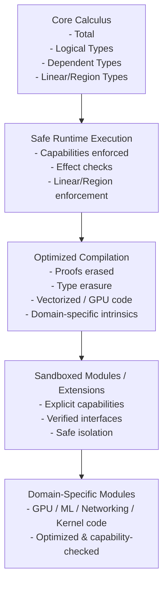
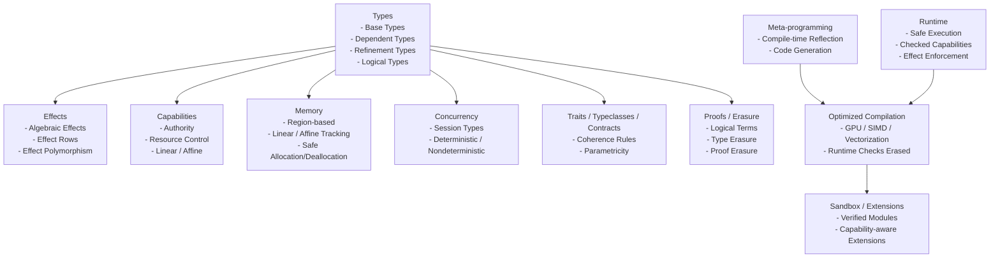
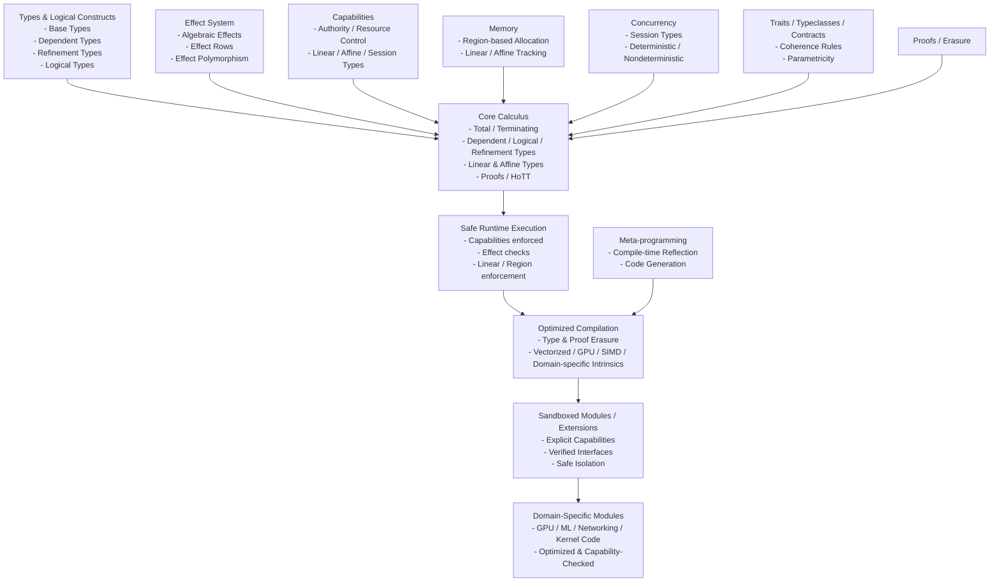

# Typed Capability Calculus Language (TCCL)
*A Stratified, Dependently Typed, Capability-Secure Systems Language*

---

# 1. Overview
[Table-of-contents](#table-of-contents)

TCCL is a research-grade programming language built around a single unifying principle:

> Everything effectful, authoritative, concurrent, or unsafe is represented as a typed capability.

It integrates:

- Type Level vs Value Level
- Total core + Turing-complete runtime stratification
- Memory safety (safe + unsafe separation)
- Capability Based inform effects
- Support Different Concurrency Models 
- Structured authority system
- Algebraic effects + handlers
- Session types for concurrency
- Contexts
- Intrinsic vs Extrinsic Typing
- Tactics
- Region-based memory
- Linear and affine types (Usage based)
- Dependent types
- Logical types
- Refinement types
- Traits / Typeclasses / Contracts / INTERFACES
- Determinism tracking
- Verified FFI boundary
- Compile-time vs runtime phase separation
- Metaprogramming
- Metainformation (inline, hints, line number, column number, file, function, sttage of compilation, tactic hints)
- Type systems (dynamic, static, duck typing)
- Namespace graphs
- Language Directives
- Core Judgements (Inference rules)
- Proof relevance
- Category Theory
- Type erasure
- Proof erasure
- Parametricity guarantees
- Contextual equivalence model
- Cost semantics
- Capability revocation
- Universe hierarchy
- Graded / quantitative resource algebra
- Deterministic replay semantics
- Homotopy Type Theory (HoTT) layer using univalence and isomorphism

The system is built on a **Typed Capability Calculus (TCC)**.

---

# Diagrams
[Table-of-contents](#table-of-contents)

## TCCL Workflow Diagram
[Table-of-contents](#table-of-contents)



## TCCL Constructs Diagram
[Table-of-contents](#table-of-contents)



# 1. Unified TCCL Architecture Diagram
[Table-of-contents](#table-of-contents)



## 2. Roadmap Diagram
[Table-of-contents](#table-of-contents)



```mermaid
graph LR
    %% Phases of TCCL Research & Implementation
    Phase1[Foundational Design\n- Typed Capability Calculus\n- Core Calculus\n- Linear / Region Types\n- Effect System]
    Phase2[Formal Verification & Proofs\n- Soundness\n- Preservation & Progress\n- Erasure & Parametricity\n- Contextual Equivalence]
    Phase3[Runtime & Safe Execution\n- Checked Runtime\n- Capabilities Enforcement\n- Session Types\n- Region Memory Management]
    Phase4[Optimized Compilation\n- GPU / SIMD / Vectorization\n- Proof / Type Erasure\n- Domain-Specific Intrinsics]
    Phase5[Sandbox & Extensions\n- Verified Plugins\n- Capability-aware Modules\n- Safe Extensions]
    Phase6[Tooling & Ergonomics\n- Linters & Effect / Capability Inference\n- Meta-programming Support\n- IDE Visualizations]
    Phase7[Adoption & Domain Integration\n- ML / GPU / Networking / Kernel Libraries\n- Gradual Typing / Interop\n- Verified FFI / Safety Boundaries]

    %% Connections
    Phase1 --> Phase2 --> Phase3 --> Phase4 --> Phase5 --> Phase6 --> Phase7
```

## 3. TCCL Roadmap
[Table-of-contents](#table-of-contents)

### Foundational Design
[Table-of-contents](#table-of-contents)

- Define typed capability calculus (TCC)
- Implement core calculus with linear/affine types, dependent types, logical/refinement types
- Model capabilities, authority, and effect system

### Formal Verification
[Table-of-contents](#table-of-contents)

- Prove preservation, progress, and soundness
- Verify erasure, parametricity, and contextual equivalence
- Integrate optional HoTT reasoning

### Runtime and Safe Execution
[Table-of-contents](#table-of-contents)

- Implement capability-checked runtime
- Enforce effect system dynamically
- Session-type concurrency support
- Linear/region-based memory enforcement

### Optimized Compilation
[Table-of-contents](#table-of-contents)

- Add compile-time erasure (proofs/types)
- Generate vectorized / GPU / SIMD / domain-specific code
- Integrate meta-programming for optimized code generation

### Sandboxing and Extensions
[Table-of-contents](#table-of-contents)

- Verified, capability-aware plugin modules
- Safe isolation for untrusted code
- Modular domain-specific extensions

### Tooling and Ergonomics
[Table-of-contents](#table-of-contents)

- Linter and IDE support for capabilities, effects, determinism
- Visualizations for authority, session types, and memory regions
- Meta-programming assistance for code generation and verification

### Adoption and Domain Integration
[Table-of-contents](#table-of-contents)

- Build libraries for ML, networking, GPU, kernel programming
- Gradual typing and interop with other languages
- Verified FFI and safe runtime boundaries

---

# Table Of Contents

- [Core Typing Judgement]
- [Type Layers]
  - [Simple and Dependent Types]
  - [Logical Types]
  - [Refinement Types]
  - [Traits / Typeclasses / Contracts]
- [Authority]
  - [Everything is a Capability]
  - [No Ambient Authority]
  - [Capability Polymorphism]
  - [Capability Passing]
  - [Capability Revocation]
- [Imports and Authorities]
- [Context System]
  - [Linear Context Splitting]
  - [Context Creation]
  - [Context Restriction]
  - [Context Integrity]
- [Algebraic Effects]
- [Session Types]
- [Region-Based Memory]
- [Determinism and Replay]
- [Compile-Time vs Runtime]
- [Type Erasure]
- [Proof Erasure]
- [Cost Semantics]
- [Parametricity]
- [Contextual Equivalence]
- [Homotopy Type Theory]
- [Soundness Strategy]
- [Meta-Theoretic Safeguards]
- [Ergonomics]
- [Design Philosophy]
- [Summary]
- [Categories](#categories)
- [Glossary](#Glossary)

---

# 2. Core Typing Judgment
[Table-of-contents](#table-of-contents)

The fundamental typing judgment is:

Γ ⊢ t : A ▷ ε ▷ κ ▷ ρ ▷ φ

Where:

- A   = value type
- ε   = effect row
- κ   = required capabilities
- ρ   = region/resource usage
- φ   = logical/refinement obligations

---

# 3. Type Layers
[Table-of-contents](#table-of-contents)

## 3.1 Simple and Dependent Types
[Table-of-contents](#table-of-contents)

A, B ::=
    Type₀ | Type₁ | Type₂ | ...
  | Π (x : A). B
  | Σ (x : A). B
  | A ⊸ B                   -- linear
  | A ⊣ B                   -- affine

Universe hierarchy prevents Girard’s paradox.

---

## 3.2 Logical Types
[Table-of-contents](#table-of-contents)

Prop : Type₀

Logical types live in World 0 (total).

Examples:

Sorted : List Int → Prop
SafeFFI : ForeignFunc → Prop
Deterministic : Term → Prop
CostBound : Term → Nat → Prop

Proofs are values inhabiting propositions:

Γ ⊢ p : P

Proofs:

- Must terminate
- Cannot perform effects
- Cannot access capabilities
- Are erased at runtime

---

## 3.3 Refinement Types
[Table-of-contents](#table-of-contents)

{x : A | P(x)}

Example:

Nat = {x : Int | x ≥ 0}

readPositive :
  (x : Int) →
  Eff {IO} {y : Int | y > 0}

Refinements are checked via:

- SMT integration
- Proof construction
- Sized-type reasoning
- Cost semantics

Refinements are erased after verification.

---

## 3.4 Traits / Typeclasses / Contracts
[Table-of-contents](#table-of-contents)

Traits:

trait Eq A {
  eq : A → A → Bool
}

Instance coherence rule:

> For any (Type, Trait) pair, at most one instance is visible in a scope.

Contracts extend traits with logical guarantees:

trait SortedContainer A {
  insert :
    (x : A) →
    {c : Self | Sorted(c)}
}

Contracts combine:
- Behavior
- Effects
- Refinements
- Capabilities

Contracts may include:

- Logical obligations
- Effect constraints
- Capability bounds
- Cost guarantees

Coherence rule:

> For any (Type, Trait) pair, at most one visible instance.

Instances may not escalate authority implicitly.

---

# 4. Authority System
[Table-of-contents](#table-of-contents)

## 4.1 Everything is a Capability
[Table-of-contents](#table-of-contents)

Authority is modeled explicitly:

Cap ::= FileRead
      | FileWrite
      | NetAccess
      | SpawnThread
      | UnsafeMem
      | Nondet
      | Deterministic
      | Region r
      | Session S
      | Cost n
      | Epoch e

Capabilities are values.
Capabilities are:

- Linear
- Affine
- Persistent
- Graded

---

## 4.2 No Ambient Authority
[Table-of-contents](#table-of-contents)

There is no global IO.
There is no implicit access.

Every function declares required capabilities:

All authority is explicit.

Functions declare capability requirements:

readFile :
  (path : String)
  →{FileRead}
  Eff {IO} String

---

## 4.3 Capability Polymorphism
[Table-of-contents](#table-of-contents)

∀ κ. f : A →{κ} B

Allows authority abstraction without over-constraining users.

---

## 4.3 Capability Passing
[Table-of-contents](#table-of-contents)

Capabilities must be passed explicitly:

main :
  (cap : FileRead)
  → Eff {IO} Unit

Refactoring remains easy because:

- Authority appears in type signatures.
- Removing authority removes capability parameters.
- Adding authority requires explicit modification.

No hidden global effects.

---

## 4.4 Capability Revocation
[Table-of-contents](#table-of-contents)

Revocation mechanisms:

1. Region-scoped capabilities
2. Epoch capabilities
3. Linear expiration tokens

Example:

grant :
  Cap → Epoch e → ScopedCap e

revoke :
  ScopedCap e → Void

Revocation ensures long-lived programs remain secure.

---

# 5. Imports and Authority
[Table-of-contents](#table-of-contents)

Imports are pure unless authority is declared.
Imports are authority-transparent.

```lang
import Math
import FileIO requires {FileRead}
import UnsafeMem unsafe
```

Modules declare:

```lang
module FileIO
  requires {FileRead}
```

This means:

- You cannot import FileIO unless your module also declares FileRead.
- Authority flows upward through module boundaries.

This makes refactoring safe:

- Removing FileRead from a module forces removal from children.
- Authority is structural and visible in signatures.


Authority must flow upward structurally.

Removing authority is mechanically enforced by the compiler.

---

# 6. Context System
[Table-of-contents](#table-of-contents)

Γ contains:

- Value bindings
- Capability bindings
- Region tokens
- Logical assumptions
- Trait instances
- Universe constraints

---

## 6.1 Linear Context Splitting
[Table-of-contents](#table-of-contents)

Γ = Γ₁ ⊗ Γ₂

Prevents duplication of linear resources.

---

## 6.2 Context Creation
[Table-of-contents](#table-of-contents)

region r {
  ...
}

Introduces r : RegionToken.

---

## 6.2 Context Restriction
[Table-of-contents](#table-of-contents)

```lang
restrict {FileRead} in {
  ...
}
```

Allows safe refactoring.

---

## 6.3 Context Integrity
[Table-of-contents](#table-of-contents)

You cannot:

- Forge capabilities
- Escalate without token
- Duplicate linear tokens
- Leak region tokens
- Introduce logical inconsistency

---

# 7. Algebraic Effects
[Table-of-contents](#table-of-contents)

Effect rows:

ε ::= {}
    | {IO}
    | {State}
    | {Spawn}
    | {Nondet}
    | {Cost}
    | ε ∪ ε

Effect polymorphism supported:

∀ ε. f : A → Eff ε B

Capabilities authorize effects.

---

# 8. Session Types
[Table-of-contents](#table-of-contents)

S ::= Send A; S
    | Recv A; S
    | End

Channels are linear capabilities.

Channels cannot be duplicated.

Session fidelity theorem:

Well-typed programs never deadlock due to protocol mismatch.

---

# 9. Region-Based Memory
[Table-of-contents](#table-of-contents)

Regions are linear capabilities.

```lang
region r {
  let x = alloc[r] 5
}
```

```lang
alloc :
  ∀ r. A → Region r A
```

No use-after-free.
No escape of region-scoped data.

---

# 10. Determinism and Replay
[Table-of-contents](#table-of-contents)

Determinism modeled as capability.

Deterministic code:
- Replayable
- Serializable
- Optimizable

Nondet requires explicit capability.

Deterministic replay semantics ensure distributed reproducibility.

---

# 11. Compile-Time vs Runtime
[Table-of-contents](#table-of-contents)

World 0:
- Total
- Logical
- Proofs
- Termination required

World 1:
- Effects
- IO
- Concurrency

World 2:
- Unsafe
- FFI

Proofs and type-only structures erased.

---

# 12. Type Erasure
[Table-of-contents](#table-of-contents)

After type checking, the program undergoes type erasure.

Erased:

- Type arguments
- Refinement predicates
- Trait dictionaries (if statically resolved)
- Phantom parameters
- Logical terms
- Universe annotations

Runtime representation retains:

- Data
- Capabilities
- Effectful constructs
- Linear resources
- Region tokens

Erasure preserves operational semantics.

Formal guarantee:

If Γ ⊢ t : A and t → t'

Then erase(t) → erase(t').

Preservation theorem:

erase(t) simulates t.

---

# 13. Proof Erasure
[Table-of-contents](#table-of-contents)

Proofs:

- Exist only in total world 
- Cannot observe runtime
- Are erased
- Exist only in World 0
- Cannot perform effects
- Must terminate

All proofs are erased before runtime.

Example:

```lang
f :
  (x : Int)
  → (p : x ≥ 0)
  → Nat
```

At runtime:

```lang
f :
  Int → Int
```

Proof argument removed.

Soundness guarantee:

Proof erasure does not alter runtime behavior.

Erasure does not change observable behavior.

---

# 14. Cost Semantics
[Table-of-contents](#table-of-contents)

Cost integrated into type system.

Example:

```lang
f :
  A → {x : B | cost(x) ≤ n}
```

Cost capability:

Cost n

Graded linear algebra supports resource budgets.

---

# 15. Parametricity
[Table-of-contents](#table-of-contents)

Relational parametricity theorem ensures:

- Representation independence
- Free theorems
- Refactor safety

Abstraction boundaries are semantically enforced.

---

# 16. Contextual Equivalence
[Table-of-contents](#table-of-contents)

Define contextual equivalence:
```lang
t₁ ≈ t₂ iff
For all contexts C,
C[t₁] and C[t₂] are observationally indistinguishable.
```

Used to prove:

- Optimization correctness
- Erasure soundness
- Refactoring safety

---

# 17. Homotopy Type Theory (Optional Layer)
[Table-of-contents](#table-of-contents)

HoTT can be integrated in World 0.

Add:

Identity types as paths.
Univalence axiom (optional, restricted).

Benefits:

- Equality as equivalence
- Safe substitution via path transport
- Structured contextual equivalence reasoning
- Higher-level abstraction guarantees

However:

HoTT must remain isolated from runtime effects.

No capability tokens allowed inside HoTT layer.

Univalence must not affect runtime computation.

HoTT is compile-time only and erased.

---

# 14. Verified FFI Boundary
[Table-of-contents](#table-of-contents)

```lang
Foreign import requires proof:

foreign import c_sin :
  Float → Float
  requires p : SafeFFI c_sin
```

Unsafe FFI requires UnsafeMem capability.

Proof erased.
Safety checked at compile-time.

---

# 18. Soundness Strategy
[Table-of-contents](#table-of-contents)

We prove:

1. Preservation
2. Progress
3. Linear soundness
4. Region safety
5. Session fidelity
6. Capability safety
7. Determinism preservation
8. Refinement preservation
9. Strong normalization (World 0)
10. Erasure preservation
11. Parametricity theorem
12. Contextual equivalence stability

Erasure theorem:

If Γ ⊢ t : A and t → t'

Then erase(t) →* erase(t').

No proof or type term affects runtime semantics.


---

# 19. Meta-Theoretic Safeguards
[Table-of-contents](#table-of-contents)

- Universe hierarchy
- Logical/runtime separation
- No reflection from runtime into Prop
- Capability-free logical layer
- Termination checking via sized types

---

# 23. Optimized Compilation Workflow
[Table-of-contents](#table-of-contents)

TCCL supports **high-performance, domain-specific compilation** without sacrificing safety.

## Workflow
[Table-of-contents](#table-of-contents)

### Safe Runtime Execution
[Table-of-contents](#table-of-contents)

- Run code with full capabilities, proof obligations, effect checks, and linear/region enforcement.
- Guarantees correctness and determinism.

```lang
fn safe_sum(xs: List Int) → Int
    requires {IO}
    ensures { cost ≤ length(xs) } 
{
    fold(xs, 0, |acc, x| acc + x)
}
```

### Meta-programming / Code Generation
[Table-of-contents](#table-of-contents)

Use compile-time reflection and metaprogramming to generate optimized code.

Infers memory layout, vectorization, GPU kernels, and unrolled loops.

```lang
@compile_optimized
fn fast_sum(xs: List Int) → Int {
    // Compiler replaces fold with unrolled vectorized code
}
```

### Ahead-of-Time / Just-in-Time Compilation
[Table-of-contents](#table-of-contents)

Verified code can be compiled to native machine code.

Proofs, refinement types, and runtime checks are erased.

Linear, affine, and region guarantees remain statically enforced.

This allows programs to run with peak performance while preserving all core calculus invariants.

# 24. Sandboxing and Safe Extensions
[Table-of-contents](#table-of-contents)

TCCL supports sandboxed execution and modular extensions.

## Sandboxing
[Table-of-contents](#table-of-contents)

- Each module or runtime session can have explicit capabilities.
- Capabilities control authority and effects, preventing unsafe behavior from leaking.

```lang
sandboxed fn run_plugin(plugin: Plugin) requires {FileRead, NetAccess} {
    plugin.run()
}
```

- Untrusted code must declare required capabilities.
- Runtime enforces capability constraints.

Extensions
- Domain-specific functionality (GPU, SIMD, ML, networking) is added as capability-aware modules.

```lang
module GPUOps using GPUCap {
    tensor_add : Tensor Float → Tensor Float → Tensor Float
    tensor_mul : Tensor Float → Tensor Float → Tensor Float
}
```

- Modules are fully verified in type signatures.
- Core calculus only sees typed capability interfaces, not unsafe internals.

---

# 20. Ergonomics
[Table-of-contents](#table-of-contents)

- Effect inference
- Capability inference
- Region inference
- Cost inference
- Refinement inference
- Capability visualization
- Effect graph
- Determinism map
- Erasure preview
- Authority audit trail

Gradual modes allow prototype → verified progression.

---

## 16.1 Inference
[Table-of-contents](#table-of-contents)

- Effect inference
- Capability inference
- Region inference
- Refinement inference

---

## 16.2 Defaults
[Table-of-contents](#table-of-contents)

- Pure by default
- Deterministic by default
- No authority by default

---

## 16.3 Refactor Safety
[Table-of-contents](#table-of-contents)

Because authority appears in signatures:

- Removing IO changes types.
- Compiler identifies all dependencies.
- No hidden global state.

---

## 16.4 Tooling

IDE support:

- Capability graph visualization
- Effect graph
- Region lifetime graph
- Session protocol diagram
- Refinement obligation tracker
- Erasure preview (compile-time vs runtime diff)

---

# 21. Design Philosophy
[Table-of-contents](#table-of-contents)

The language guarantees:

- No authority without capability
- No effect without authorization
- No resource leak
- No protocol mismatch
- No unsound FFI
- No hidden nondeterminism
- No logical inconsistency
- No runtime cost from proofs
- No unsound substitution
- No abstraction leakage

Everything explicit.
Everything typed.
Everything compositional.
Everything erasable where safe.

Key Principles

Explicit authority: Sandbox modules cannot access more than declared capabilities.

Safe erasure: Proofs, logical terms, and refinement checks removed at runtime or compilation.

Composable optimizations: Optimized modules can replace safe core code transparently.

Refactorable and deterministic: Even after optimization or sandboxing, code remains safe, deterministic, and compatible with type and capability inference.

Sandboxing + capability-aware extensions let TCCL achieve perfect expressiveness while allowing high-performance, domain-specific execution, all without compromising the foundational guarantees.

---

# 22. Summary
[Table-of-contents](#table-of-contents)

TCCL is a stratified, dependently typed, capability-secure calculus
integrating:

- Authority control
- Effect systems
- Session concurrency
- Region memory
- Determinism tracking
- Logical reasoning
- Refinement types
- Traits and contracts
- Cost semantics
- Parametricity
- Contextual equivalence
- Type and proof erasure
- Optional HoTT reasoning layer

It is designed for:

- Secure systems programming
- Verified software
- Deterministic distributed systems
- Capability-secure architectures
- Foundational programming language research

---

# Categories
[Table of Contents](#table-of-contents)

- [Capability + effect language design]
- [Modules / Language Architecture]
- [Proof / Logic Concepts]
- [Control Flow Techniques]
- [Data-Oriented Programming Techniques]
- [Concurrency Programming Techniques]
- [Memory Management Techniques]
- [Metaprogramming Techniques]
- [Type-Driven Programming Techniques]
- [Program Transformation Techniques]
- [Architectural Programming Techniques]
- [Mathematical / Logic Programming Techniques]
- [Effect & Control Techniques]
- [Memory Safety & Resource Techniques]
- [Advanced Type System Techniques]
- [Program Optimization Techniques]
- [Distributed Programming Techniques]
- [Program Verification Techniques]
- [DSL and Language Construction Techniques]
- [Runtime & Execution Techniques]
- [Program Structure Techniques]
- [Programming Paradigms]
- [Evaluation Strategies]
- [Pattern Matching Techniques]
- [Polymorphism Variants]
- [Program Analysis Techniques]
- [Advanced Data Type Techniques]
- [Advanced Metaprogramming Techniques]
- [Scheduling Techniques]
- [Language Interoperability Techniques]
- [Security-Oriented Programming Techniques]
- [Advanced Concurrency / Parallelism]
- [Advanced Mathematical Programming Concepts]
- [Advanced Type / Logic Techniques]
- [Advanced Effect / Capability Techniques]
- [Modern / Higher-Level Concurrency Constructs]
- [Program Verification / Proof Techniques]
- [Program Transformation / Compiler Techniques]
- [Runtime / System Techniques]
- [Niche but Useful Concepts]
- [Classical Concurrency Primitives]
- [Memory / Resource Concurrency Techniques]
- [Highly Language-Specific Features]
- [Hardware / OS-Specific Implementation Concepts]

# Glossary
[Table of Contents](#table-of-contents)

| Term                                  | Definitions | Related Categories |
|---------------------------------------|-------------|--------------------|
| **A** | |
| Abstract Syntax Tree (AST) | Tree representation of parsed program structure where nodes correspond to language constructs such as expressions and declarations. |
| Actor Model | Concurrency model where independent actors communicate via asynchronous message passing. |
| Assembly Instructions | Low-level CPU instructions executed directly by hardware. |
| Authority | Permissions granted to a program component allowing it to perform operations. |
| ↳ No Authority | Component has no permissions and cannot perform effects. |
| ↳ Privilege | Specific permission to perform restricted operations. |
| ↳ Total Authority | Component has unrestricted permissions. |
| ACTOR MODEL |
| OTHER CONCURRENCY MODELS ||
| ALGEBRAIC EFFECTS ||
| ALGEBRAIC DATA TYPES ||
| Algorithm W | Classic Hindley-Milner inference algorithm.| 
| Algorithm M | Alternative inference algorithm.|
| Algebraic Effects | Modular representation of effects. | 
| Applicative Functor | Less powerful alternative to monads. | 
| Adjunction | Relationship between categories. | 
| Anamorphism (Unfold) | Building structures from seed values. | 
| Algebraic Effects | Effects represented as operations + handlers. | 
| Async/Await | Structured asynchronous control flow. | 
| Actor Supervision Trees | Fault tolerance structure used in Erlang. | 
| Abstract Interpretation | Static approximation of program behavior. | 
| Ahead-of-Time Compilation (AOT) | Compiling before execution. | 
| Algebraic Effects | 
| Applicative Order Reduction | Evaluate arguments first (typical languages). | 
| Arena Allocation | Allocating memory in bulk regions. | 
| Ad-hoc Polymorphism | Overloading (type classes).| 
| Alias Analysis | Determining if references refer to the same memory. | 
| Actor Scheduling | Actors scheduled independently. | 
| ABI (Application Binary Interface) | Binary-level compatibility between languages. | 
| Algebraic Data Types | 
| Authority Inference | Automatic derivation of capabilities needed for code.| 
| Administrative Normal Form (ANF) | Intermediate representation simplifying evaluation order.| 
| Async/Await | Structured syntax for writing asynchronous code sequentially. | 
| ADIMINISTRATIVE NORMAL FORM (ANF) ||
| ASYNC RESULTS ||
| AFFINE USAGE ||
||
| **B** | |
| BNF | Backus–Naur Form, a notation used to define programming language grammars. |
| Bytecode | Intermediate instructions executed by a virtual machine. |
| Bytecode VM | Virtual machine executing bytecode. | 
| Bidirectional Type Checking | 
| Barrier | Synchronization point where threads wait until all have reached it. | 
| Branch Prediction | CPU hardware technique to speculatively execute instructions to avoid stalls. |
| BACKEND IR ||
| BOUNDED USAGE ||
| Big-Step Semantics | Evaluates expressions directly to final results. | 
| Build / Package System |
| Backtracking | Exploring multiple execution paths automatically. | 
| Borrow Checking | Ensuring references obey lifetime rules. | 
||
| **C** | |
| Capabilities | Explicit tokens representing authority to perform operations. |
| ↳ Capability Lowering | Compilation stage translating capability types into runtime representations. |
| ↳ Row-based Capability Solver | Type-level system resolving capability constraints expressed as rows. |
| Category Theory | Mathematical framework describing objects and morphisms. |
| ↳ Cartesian Closed Categories | Categories corresponding to simply typed lambda calculus. |
| ↳ Categories | Structures consisting of objects and morphisms with composition laws. |
| ↳ Categories with Families (CWF) | Categorical model of dependent type theory. |
| ↳ Cubical Monoidal CWF | Category model combining cubical type theory with monoidal resource structure. |
| ↳ Homomorphism | Structure-preserving mapping between algebraic structures. |
| ↳ Monoidal Categories | Categories modeling resource composition and linear constraints. |
| ↳ Presheaf / Cubical | Category-theoretic models used in cubical type theory. |
| ↳ ∞-groupoid categories | Higher categorical models capturing homotopy type theory semantics. |
| Categories | |
| Cartesian Closed Categories (CCC) | Corresponds to typical simply typed lambda calculus along with functions as well as tuples (products) and tagged unions (disjoint sums) |
| Monoidal Categories               | Capabilities + Linear Constraints |
| Categories with Families (CWF)    | Practical Computational Model |
| Presheaf / Cubical                | Practical Computational Model (Cubical HoTT) |
| Cubical Monoidal CWF              | Good target |
| ∞-groupoid categories             | largest category, fully capture HoTT semantics. However, this is not constructive |
| Compiler | Program translating source code into another representation such as machine code or bytecode. |
| ↳ Backend | Compiler stages responsible for optimization and code generation. |
| ↳ Backend IR | Final intermediate representation used before code generation. |
| ↳ Frontend | Compiler stages responsible for parsing and semantic analysis. |
| ↳ IR | Intermediate representation used internally by a compiler. |
| ↳ Lower IR | Low-level IR closer to machine instructions. |
| Concurrency | Multiple computational tasks progressing during overlapping time. |
| ↳ Async Results | Results produced asynchronously. |
| ↳ Channels | Message passing communication primitives. |
| ↳ Futures / Promises | Objects representing values that will be available later. |
| ↳ Parallelism | Simultaneous execution of computations. |
| ↳ Processes | Independent units of execution. |
| ↳ Shared Memory | Memory accessible by multiple threads. |
| ↳ Shared Queues | Concurrent queues used for coordination between tasks. |
| ↳ Single Threaded | Execution model with only one thread. |
| ↳ Threading | Execution using multiple threads. |
| Constraints | Logical conditions imposed on types or programs. |
| ↳ Constraint Solver | System that resolves constraints during type checking or inference. |
| ↳ Constraint Types | Types defined by logical predicates. |
| CONSTRAINT TYPES ||
| Context | Typing environment containing variable bindings, assumptions, or capabilities. |
| ↳ Scopes | Regions where bindings are visible. |
| ↳ Stack of Scopes | Hierarchical scope structure used by compilers. |
| CURRY-HOWARD CORRESPONDENCE ||
| Curry-Howard-Lambek CORRESPONDENCE ||
| Currying ||
| Constructive ||
| Constructive vs Nonconstructive ||
| CONTRACTS || 
| COMPUTATION ||
| Component-Based Design  | Building software using reusable components. | 
| Code Generation | Automatically producing code. | 
| Compile-Time Evaluation | Executing code during compilation. | 
| Capability Passing | Explicit passing of permissions or authority tokens. | 
| Constraint Programming | Solving problems through constraint satisfaction. | 
| Capability Passing | 
| Catamorphism (Fold) | Generalized recursion over data structures. | 
| Church Encoding | Representing data structures using functions. | 
| Call/CC (call-with-current-continuation) | Captures entire continuation. | 
| Cancellation Propagation | Structured cancellation across tasks. | 
| Copy-on-Write | Cloning data only when modified. | 
| Common Subexpression Elimination | Reusing identical computations. | 
| CRDTs | Conflict-free replicated data types. | 
| Consensus Algorithms | Distributed agreement (Raft, Paxos). | 
| Component-Based Design | Systems built from independent components. | 
| Call-by-Value | Function arguments evaluated before function application. | 
| Call-by-Name | Arguments evaluated only when used. | 
| Call-by-Need | Lazy evaluation with memoization. | 
| Coinductive Types	| Infinite structures like streams.| 
| CPU Pipeline | Sequential stages (fetch, decode, execute, memory, writeback) for instruction-level parallelism. | 
| Cache Management | Optimizations of memory access through CPU caches (L1/L2/L3) to reduce latency. | 
| Cubical Type Theory Variants| Advanced HoTT constructs like ∞-groupoids for homotopy semantics. |
| Cubical / Higher Inductive Types | Types with computational paths as constructors, used in research-level HoTT. |
| CONTRACTIBLE ||
| CHECKSUM ||
| CHANNELS ||
| COMPUTATIONAL GRAPH ||
| CONCURRENCY MODEL ||
| CAPABILITY LOWERING ||
| CLOSURE CONVERSION ||
| CLOSURES || 
| CLOSURE CONVERSION ||
| Condition Variable | Allows threads to wait for certain conditions while releasing locks. | 
| Canonical Forms Lemmas | Needed in type soundness proofs.| 
| Continuation-Passing Style (CPS) | Transforming control flow into continuations.| 
| Closure Conversion | Converting functions with free variables into closures.| 
| Cooperative Scheduling | Tasks yield control voluntarily. | 
| Compile-Time Reflection| Inspecting program structure during compilation.| 
| Capability Safety	| Ensuring capabilities cannot be forged.| 
| Coinductive Types | 
| Continuation Passing Style | 
| Coproduct Types | Another name for sum types; explicit in category theory. | 
| Capability Revocation | Ability to revoke authority safely.|
| Control Flow Graph (CFG) | Graph representation of program execution paths. | 
| Constraint Generation | Producing constraints during type inference.| 
| Constraint Propagation | Passing constraints through the system.| 
| Constraint Simplification | Reducing constraint expressions.| 
| Compiler Architecture | 
| Constant Folding | Evaluating constants at compile time. | 
| Capability Safety | Guarantee authority cannot be forged. | 
| Concurrency Models | 
| CSP (Communicating Sequential Processes) | Channel-based concurrency model. | 
| Category Theory (Programming Focus) | 
| Canonical Forms | Normal forms guaranteed by type system. | 
| CPS Transformation |	Converts code to continuation passing style. |
| Content Addressable Storage | Hash-based storage for builds. | 
| Corecursion | Producing potentially infinite structures. | 
| Continuation Passing Style (CPS) | Explicit representation of control flow using continuations. | 
| Coroutines | Functions that suspend and resume execution. | 
||
| **D** | |
| Data Structures | Concrete implementations of data organization optimized for operations. |
| Data Types | Formal definitions describing sets of values and operations. |
| Dependent Types | Types that depend on values. |
| Desugaring | Translation of high-level syntax into simpler core language constructs. |
| ↳ Desugaring Macros | Macros that expand purely into simpler syntax. |
| DSA | Data Structures and Algorithms. |
| DETERMINISM ||
| Defunctionalization | Replacing higher-order functions with data structures. | 
| Delimited Continuations | 
| Dependency Injection | Passing dependencies instead of creating them internally. | 
| Dependent pattern matching | 
| Defunctionalization | 
| Data Parallelism | Parallel operations on large data sets. | 
| Dataflow Analysis | Tracks values through program control flow.| 
| DENOTATIONAL SEMANTICS ||
| Dead Code Elimination	| Removing unused computations. | 
| Delimited Continuations | Capturing partial continuations. | 
| Data-Oriented Design | Structuring programs around data layout and access patterns. | 
| Delimited Continuations | Partial continuation capture. | 
| Distributed Transactions | Coordinated updates across nodes. | 
| Dead Store Elimination | Removing writes that are never read. | 
| Dependent Pattern Matching | Pattern matching that refines types. | 
| Dependent Pattern Matching | Pattern matching that refines types. | 
| Dependent Records / Sigma Types | Records whose fields can depend on earlier fields; common in dependent type systems. | 
| Dependant Intersection / Union Types | Combining types that depend on runtime values. | 
| Deterministic Concurrency	Guarantees same output regardless of thread scheduling. | 
| Defunctionalization | Eliminating higher-order functions by representing them as data.| 
| Dependent Pattern Matching | Refining types while matching on values. | 
| Dependent Pattern Matching (Agda / Idris) | Pattern matching where the type of the result depends on the matched value. | 
| Deterministic Concurrency | Ensures that program behavior does not depend on thread scheduling. | 
| DATAFLOW ||
| DEFINTIIONAL EQUALITY ||
| DEFINITIONAL INEQUALITY |||
| DEPENDENCIES ||
| Delimited Continuations | 
| Declarative Programming | 
| Dataflow Programming |
| Dependent Pattern Matching | 
| Defunctionalization | Replaces higher-order functions with data structures. |
| Dependency Graph | Graph of package dependencies. |
||
| **E** | |
| Effects | Observable interactions such as I/O, mutation, or exceptions. |
| ↳ Arbitrary Effects | Unrestricted side effects permitted by the runtime. |
| ↳ Effect Lowering | Compilation step converting effect abstractions into runtime mechanisms. |
| Elaboration | Compiler stage translating surface syntax into typed core language representation. |
| ↳ Expander | Component responsible for macro expansion. |
| Erasure | Removal of compile-time constructs not needed at runtime. |
| ↳ Proof Erasure | Removal of proof terms after verification. |
| ↳ Type Erasure | Removal of type annotations during compilation. |
| EXTRACTION ||
| PROOF EXTRACTION ||
| EQUALITIES ||
| ↳ Definitional Equality | 
| ↳ Propositional Equality |
| ↳ Structural Equality |
| ↳ Nominal Equality |
| ↳ Observational Equality |
| ↳ Pointer / Reference Equality |
| ↳ Alpha-Equivalence |
| ↳ Beta-Equivalence |
| ↳ Eta-Equivalence | 
| ↳ Simulation | 
| ↳ Bisimulation |
| Effects and Capability Systems | 
| Equational Reasoning | Reasoning about programs using algebraic laws. | 
| Effect System	| Tracks side effects at the type level. | 
| Effect Rows | Row-polymorphic representation of effects. | 
| Effect Handlers | Structured control of effects. | 
| Escape Analysis | Determining whether objects escape scope. | 
| Effect Handlers | Interpreters for algebraic effects. | 
| Escape Analysis | Determining stack vs heap allocation. | 
| Event Sourcing | State derived from event history. | 
| Effect Handlers | 
| Elimination Rules | Use values of a type. | 
| Exception Handling | Structured error propagation. | 
| Embedded DSL (EDSL) | Domain-specific languages embedded in host languages. | 
| External DSL | Standalone domain-specific language. | 
| Elaboration-based compilation | 
| Effect Handlers | 
| Effect Polymorphism | Functions can work over unknown effects.| 
| Evaluation Strategy | 
| Escape Analysis | Detecting if values escape scope. | 
| Exhaustiveness Checking | Verifying all cases are handled. | 
| Effect Handlers | 
| Embedded DSLs / Tagless Final	| Internal domain-specific languages. | 
| Event-Driven Programming | Concurrency based on reacting to events instead of threads. | 
| ERASABLE ||
| EFFECT LOWERING ||
| Event-Driven Programming | Programs structured around events. | 
||
| **F** | |
| Function | Mapping from inputs to outputs. |
| ↳ Function Arguments | Values passed into a function call. |
| ↳ Parametric Functions | Functions parameterized over types. |
| Foreign Function Interface (FFI) | Mechanism allowing code in one language to call code written in another. |
| Functor | Mapping between categories preserving structure. | 
| Final Coalgebra | Model for coinductive types. | 
| Functor (Module) | Parameterized modules (OCaml style). | 
| Fibers | Cooperative lightweight threads. | 
| Function Composition | Combining functions to produce a new function. | 
| Free Monads | Represent computations as data structures. | 
| Futures / Promises | Asynchronous value placeholders (you have this but could expand).| 
| Foreign Data Representation | Mapping types between languages. | 
| Functional Programming | 
| Futures / Promises | Placeholders for values that are computed asynchronously. | 
| Factories |
| FUTURES ? PROMISES ||
||
| **G** || 
| GRAMMAR ||
| GENERALIZATION |
| GENERIC ABSTRACT DATA TYPES ||
| Generators | Functions producing sequences lazily. | 
| Guard Clauses	| Early exit conditions simplifying control flow. | 
| Garbage Collection | Automatic memory management. | 
| Green Threads | Lightweight user-space threads. | 
| Gradual typing | 
| Guarded recursion | 
| Guarded Patterns | Conditional patterns. | 
| GHC Optimizations (Haskell) | Compiler-specific optimizations like worker-wrapper transformation, strictness analysis, and rule-based rewrite optimizations. |
| Garbage Collection Strategies	| Reference counting, mark-sweep, generational GC. | 
| Gradual Typing | Mixing static and dynamic typing. | 
| Guarded Recursion	| Ensures productivity in infinite or coinductive computations. |
||
| **H** | |
| Homoiconic | Property where programs are represented using the language’s own data structures. |
| HoTT | Homotopy Type Theory connecting type theory with homotopy theory. |
| HOMOMORPHISM ||
| Hindley-Milner ||
| Higher-Rank Types	| Polymorphism nested inside function arguments. | 
| Hot Code Reloading | Updating code without restarting program. | 
| Higher-Rank Polymorphism | Quantifiers inside function arguments.| 
| Higher-Order Functions | Functions that take other functions as arguments or return them. | 
| Hermetic Builds | Builds independent of system environment. | 
| Higher-Order Unification | Needed for dependent types.| 
| HIGHER-KINDED TYPES ||
| Hylomorphism | Combination of unfold + fold. | 
| Hot Code Swapping	| Dynamic replacement of code at runtime. | 
| HASH || 
||
| **I** || 
| Imports | Mechanism for accessing definitions from other modules. |
| Inference Rules | Logical rules used to derive new judgments. |
| ↳ Type Inference | Automatic deduction of types without explicit annotations. |
| Interface | Public specification of module functionality. |
| IR | Intermediate representation used by compilers. |
| INPUTS ||
| INFERENCE ||
| Initial Algebra | Model for inductive types. | 
| INSTANTIATION ||
| Inlining | Replacing function calls with function body. | 
| INDUCTIVE TYPES ||
| IMPLICIT ||
| IMPLICIT ARGUMENTS ||
| Interior Mutability | Controlled mutation within immutable structures. | 
| Indexed Types | Types indexed by values. | 
| Instance Resolution | Automatic selection of type class implementations. | 
| Implicit Parameters | Automatically resolved arguments. | 
| Interpreter | Direct execution of source or IR. | 
| Imperative Programming | 
| Impredicative Polymorphism | Quantification over all types including polymorphic ones.| 
| Indexed Data Types | Types indexed by values.| 
| Inductive Types | Finite data defined by constructors.| 
| Information Flow Control | Preventing secret data leaks.| 
| Inductive Types |
| Irrelevant / Proof-Only Arguments | Arguments used for proofs but erased at runtime. | 
| Inlining / Partial Evaluation	| Optimization techniques.| 
| INHABITED || 
| Inlining | Function body substitution optimization.
| Incremental Compilation | Only recompiling changed code. | 
| Introduction Rules | Construct values of a type. | 
| Immutability | Avoiding mutable state. |
| Inlining | Replacing function calls with their body. | 
| Inversion of Control | Delegating control flow to external frameworks. | 
||
| **J** || 
| JUDGEMENTS ||
| ↳ Context Rules ||
| ↳ Variable Rules ||
| ↳ Function Rules ||
| ↳ Subtyping Rules ||
| ↳ Product Types Rules ||
| ↳ Sum Types Rules ||
| ↳ Type Inference Rules ||
| ↳ Constraint Generation Rules ||
| ↳ Dependent Type Rules ||
| ↳ Capability / Effect Typing Rules ||
| ↳ Linear Typing Rules ||
| ↳ Module Typing Rules ||
| ↳ Equality Types Rules ||
| ↳ Introduction Rules ||
| ↳ Application Rules ||
| ↳ Elimination Rules ||
| ↳ Normalization / Conversion Rules ||
| ↳ Hindley-Milner Types Rules ||
| Just-In-Time Compilation (JIT) | Compiling code during runtime. | 
| Judgment Forms | Types of logical statements (e.g. Γ ⊢ e : τ). | 
||
| **K** || 
| KIND SYSTEMS ||
| KINDS || 
| K-BOUNDED USAGE ||
||
| **L** | |
| Lexer | Compiler component converting source text into tokens. |
| ↳ TOKENIZER | Lexer is sometimes called a tokenizer| 
| Linearity | Property where values must be used exactly once. |
| ↳ Affine Usage | Value may be used at most once. |
| ↳ Bounded Usage | Value may be used a limited number of times. |
| ↳ K-Bounded Usage | Value may be used at most K times. |
| ↳ Linear Usage | Value must be used exactly once. |
| ↳ Unbounded Usage | Value may be used arbitrarily many times. |
| LOGICAL TYPES ||
| Lambda Calculus ||
| Logical Relations Beyond Parametricity | Techniques for proving program equivalence or type safety in very advanced type systems. |
| LOWER IR ||
| LINEAR USAGE ||
| LOCKFILE ||
| Lexical scoping |
| Linear / Affine Session Types	| Type systems modeling communication protocols with strict usage guarantees. |
| Liveness Analysis	| Determining which variables are used later. | 
| LLVM |
| Linear / Affine Concurrency	| Ensures resources (e.g., capabilities) are accessed exactly once or at most once. | 
| Lock-Free Programming | Algorithms designed to avoid locks entirely. | 
| Lazy / Strict Evaluation Runtime | Affecting performance and evaluation semantics. | 
| Linear / Affine Effects | Ensures effects or resources are used exactly once or at most once.|  
| Lock-Free Data Structures	| Concurrent programming without locks.|
| Logical Relations	| Technique for proving type system properties. | 
| Logical Relations |
| Lambda Lifting | Moves nested functions to top-level. |
| Logical Relations	| Technique for proving type system properties. |
| Lazy Evaluation | Delaying computation until results are needed. | 
| Lock-Based Synchronization | Mutual exclusion using locks. | 
| Lock-Free Programming	| Algorithms avoiding locks entirely. | 
| Lambda Lifting | Moving nested functions to top-level definitions. | 
| Layered Architecture | Organizing code into hierarchical layers. | 
| Logic Programming | Programming using logical rules and queries. | 
| Loop Unrolling | Expanding loops to reduce overhead. | 
| Language Workbenches | Tools for building programming languages. | 
| Linear capabilities | 
| Lazy Evaluation | Evaluation delayed until necessary. | 
| Logic Programming |
| Loop Fusion | Combining loops to reduce overhead. | 
| Loop Tiling | Optimizing memory locality. | 
||
| **M** || 
| Macros | Compile-time transformations generating or modifying code. |
| ↳ Macro Engine | System responsible for executing macro expansions. |
| ↳ MSP Support | Multi-stage programming support enabling compile-time code generation. |
| Machine Code | Binary instructions executed directly by processors. |
| Modules | Organizational units grouping related definitions. |
| Martin-lof ||
| MONADS ||
| Message Passing | Communication via messages rather than shared memory (e.g., Actor Model). | 
| Monitor | High-level abstraction combining mutual exclusion and condition variables. | 
| MACHINE CODE ||
| Mutex (Mutual Exclusion Lock) | Ensures that only one thread accesses a critical section at a time. | 
| Memory Fences / Barriers | Low-level synchronization primitives to enforce ordering of memory operations. |
| Model Checking | Exhaustive state exploration. | 
| Mutually Recursive Types | Types referencing each other.|
| Marshalling | Converting data formats across boundaries.| 
| Monad | Structure representing computations with context. | 
| Modules | |
| Module System	| Structure for organizing code. | 
| Macro Systems	 | Compile-time code transformations. | 
| Memoization | Caching function results for reuse. | 
| Message Passing | Communication between concurrent processes via messages. | 
||
| **N** | |
| Non-Determinism | Computation where multiple possible outcomes may occur. |
| Normalization | Reduction of expressions to canonical form. |
| ↳ Strong Normalization | Property where every valid program eventually terminates. |
| Natural Transformation | Mapping between functors. | 
| Newtype Pattern | Wrapping types to enforce stronger type safety. | 
| Normalization by Evaluation | 
| Normal Order Reduction | Leftmost outermost evaluation strategy. | 
| Normalization by evaluation | 
| Normalization by Evaluation (NbE)	| Evaluating terms to compute normal forms. | 
| Normalization by Evaluation | 
| Normalization Proofs | Guarantee of strong normalization.| 
| Non-Lexical Lifetimes (Rust) | Lifetime analysis that allows references to end before the end of their enclosing scope. |
| NUMA Awareness | Optimizing memory access patterns for Non-Uniform Memory Access architectures. |
| Normalization by Evaluation (NbE) for Dependent Types	| Advanced term evaluation for proving properties in dependently typed languages. |
||
| **O** || 
| OUTPUTS ||
| OBSERVATIONS ||
| OCCURS CHECK ||
| Opaque Types | Hidden implementations. | 
| Ownership Types | 
| Optimization Pass	| Compiler stage improving performance. | 
| Observational Equivalence | Programs indistinguishable by observation. | 
| Object-Oriented Programming | 
| Ownership Types | 
| Or-Patterns | Matching multiple patterns in one case. | 
| Ownership and Borrowing | Memory/resource safety (Rust-style). | 
| Ownership Types | Tracking resource ownership statically. | 
| Ownership Systems | Compile-time memory safety through ownership tracking (Rust-style). | 

||
| **P** | |
| Parser | Component converting tokens into an AST. |
| Proofs | Formal derivations demonstrating propositions. |
| ↳ Proof Extraction | Generating executable programs from constructive proofs. |
| ↳ Proof System | Framework defining proof construction rules. |
| ↳ Proof Erasure ||
| ↳ Tactics | Procedural tools assisting proof construction. |
| POLARITY ||
| TYPE POLARITY || 
| PURITY ||
| PARAMETERS ||
| PARAMETRIC FUNCTIONS ||
| PARSER ||
| PRIMATIVES ||
| PRIVELEDGE ||
| PROCESSES ||
| PARALLELISM ||
| PROPOSITIONAL TYPES ||
| PROPOSITION ||
| PATTERN MATCHING ||
| π-Calculus | Mathematical model of concurrent systems. | 
| Program Transformation / IR | 
| Partial Application | Fixing some arguments of a function to produce a new function. | 
| Point-Free Style | Writing functions without explicitly mentioning arguments. | 
| Persistent Data Structures | Immutable data structures supporting efficient updates. | 
| Proof-Driven Development | Writing proofs alongside programs. | 
| Phantom Types | Types used for compile-time guarantees without runtime representation. | 
| Partial Evaluation | Precomputing parts of a program. | 
| Program Specialization | Optimizing programs for specific inputs. | 
| Proof Extraction | 
| Persistent Data Structures | 
| Partial Evaluation | 
| Paramorphism | Recursion with access to the original structure. | 
| Pipeline Parallelism | Computation broken into processing stages. | 
| Proof irrelevance | 
| Pattern Compilation | Transforming pattern matches into decision trees. | 
| Parametric Polymorphism | Generic functions over types.|
| Phantom Types	| Type parameters not used at runtime.| 
| Points-to Analysis | Tracking pointer targets. | 
| Preemptive Scheduling | OS interrupts tasks. | 
| Proof Irrelevance	| Proofs ignored for equality. | 
| Parametricity	| Free theorems derived from polymorphism. | 
| Polymorphism |
| Proof Irrelevance / Relevance	| Distinguishing runtime-relevant vs erased proofs.| 
| Projectional Editing / Structural Editing | Editing AST directly instead of text. | 
| Prefetching | Loading memory into cache before it is actually needed to hide latency. |
| Projectional Editing / Structural Editing	| Editing ASTs directly rather than textual source code; mostly research IDEs. |
| Proof-Carrying Code | Programs distributed with correctness proofs. | 
| Projectional Editing | Editing ASTs directly instead of text. | 
| Pipeline Architecture | Programs composed of sequential processing stages. | 
| Plugin Systems | Extensible architectures using plugins. | 
| Paradigm | 
| Proof-Carrying Code |
||
| **Q** || 
| Quasiquotation| Code templates with holes.| 
||
| **R** | |
| Runtime | Environment where compiled programs execute. |
| REQUIREMENTS ||
| ROW-BASED CAPABILITY SOLVER ||
| REPRODUCIBLE BUILDS ||
| Register Allocation | Mapping variables to CPU registers. | 
| Reduction Semantics | Term rewriting model of evaluation. | 
| Reactive Programming |
| Refinement Checking | Verifying implementation matches specification. | 
| Region Inference |
| Reflection| Programs inspecting their structure.| 
| Reification| Turning runtime structures into code/data.| 
| Row Polymorphism | Flexible extensible records/effects.| 
| Recursive Types | Types defined in terms of themselves.| 
| Reactive Streams / Observables | Dataflow programming with asynchronous streams. | 
| Read-Write Lock | Allows multiple readers or one writer to access a resource. |
| Refinement Reflection	| Using theorem proving to reflect properties of code into type-level constraints. |
| Refinement Types / Liquid Types | Types constrained by predicates.| 
| Row Polymorphism |
| Reactive Streams / Observables | Dataflow style concurrency.| 
| Reactive Programming | Programming with asynchronous data streams. | 
| Recursion | Function calling itself. | 
| Re-exports | Forwarding definitions from other modules. | 
| Reference Counting | Tracking references to determine object lifetime. | 
| Region-Based Memory | Memory grouped by lifetime regions. | 
| Reflection | Programs inspecting their own structure. | 
| Relational Programming | Describing relations rather than functions. | 
| Region Inference | Automatically determining memory regions. | 
| Region-Based Memory | 
||
| **S** | |
| Safe vs Unsafe | Safe code guarantees correctness properties while unsafe code may bypass safety checks. |
| Semantics | Meaning of programs beyond syntax. |
| SMT | Satisfiability Modulo Theories solver used for automated reasoning. |
| STRUCTURED ||
| SHARED-MEMORY ||
| SAFE VS UNSAFE ||
| SCOPES ||
| ↳ STACK OF SCOPES ||
| STAGES ||
| ↳ MULTISTAGES ||
| SYMBOL CHECKER ||
| SUBTYPING ||
| SEMANTICS ||
| OPERATIONAL SEMANTICS ||
| SINGLE THREADED ||
| Stratification ||
| Substitution | Replacing type variables with types.| 
| Semantics |
| Static Analysis | Compile-time program analysis.| 
| SSA Form (Static Single Assignment) | Common IR representation used in compilers. | 
| Small-Step Semantics | Evaluates programs step-by-step. | 
| Signature | Module interface specification. | 
| Structural Sharing | Sharing memory between immutable data versions. | 
| Strict Evaluation	| Evaluating expressions immediately. | 
| Structural Recursion | Recursion following the structure of a data type. | 
| SANDBOX BUILDS ||
| SEMANTIC VERSIONING ||
| SIGNED || 
| STM ||
| SHARED MEMORY ||
| SHARED QUEUES ||
| Symbolic Computation | Manipulating symbolic expressions. | 
| Stack Allocation | Allocating objects on the call stack. | 
| Staged Programming | Generating code across multiple compilation stages. | 
| Structured Concurrency | Scoped management of concurrent tasks. | 
| Symbolic Execution | Executing programs with symbolic inputs. | 
| Singleton Types | Types with exactly one inhabitant. | 
| Strength Reduction | Replacing expensive operations with cheaper ones. | 
| Syntax Extensions | Extending language grammar via macros or plugins. | 
| Session types | 
| Session Types | 
| Strict Evaluation | All arguments evaluated eagerly. | 
| Staging| Multi-phase program generation.| 
| Shape Analysis | Analyzing heap data structures. | 
| Subtype Polymorphism | Using subtypes interchangeably.| 
| Serialization	| Converting objects into transferable formats.| 
| Sandboxing | Restricting program execution environment. | 
| Singleton / Unit Types | Useful for phantom types, capabilities, and type-level computations. | 
| Secure Multi-Party Computation | Computation over private data. | 
| Scoped Effects / Regions | Restricting effect lifetimes to a block of code.| 
| Software Transactional Memory (STM) | Composable atomic memory transactions.| 
| Sequent Calculus | Another formal proof style besides natural deduction.| 
| Semaphore	| A synchronization primitive that maintains a counter to control access to shared resources, typically supporting wait (decrement) and signal (increment) operations. | 
| ↳ Binary Semaphore | A semaphore that can only be 0 or 1; functions like a mutex. | 
| ↳ Counting Semaphore | A semaphore that can take any non-negative integer, controlling access to multiple instances of a resource. | 
| Spinlock | A lock where a thread repeatedly checks until it acquires the lock (busy-wait). | 
| Security Model |
| Software Transactional Memory (STM) | Composable atomic memory transactions for concurrency. | 
| Multi-Stage Programming | Generating code in multiple compilation stages.| 
| Stack vs Heap Allocation | Memory layout implications. | 
| Session Types	| Typing communication protocols in concurrency. | 
| Scala Implicits | Mechanism to provide arguments automatically based on type, used for typeclass-like programming. | 
||
| **T** | |
| TYPE UNIVERSE ||
| TYPE FORMATION ||
| TERM TYPING ||
| TRANSATIVE DEPENDENCIES ||
| TRANSACTIONAL MEMORY ||
| Termination | Property where evaluation eventually completes. |
| TYPECLASSES ||
| TYPE THEORY |
| Type System | Framework enforcing correctness constraints through types. |
| ↳ Bidirectional Type Checking | Typing approach combining inference and checking phases. |
| ↳ Duck Typing | Dynamic typing based on supported operations. |
| ↳ Extrinsic Typing | Typing judgments applied externally to syntax. |
| ↳ Intrinsic Typing | Typing encoded directly in syntax. |
| ↳ Structural Typing | Type compatibility based on structure. |
| ↳ Subtyping | Relationship where one type may substitute another. |
| ↳ Type Checking | Verification that programs conform to type rules. |
| ↳ Type Inference | Automatic deduction of types. |
| PRINCIPLE TYPES ||
| COINDUCTIVE TYPES ||
| TYPE FAMILIES ||
| Type Universe | Type whose elements are themselves types. |
| Type Formation | Rules describing how new types are constructed. |
| Term Typing | Rules assigning types to terms. |
| Typing | Assignment of types to expressions. |
| THREADING ||
| ↳ SINGLE THREADED ||
| ↳ MULTI THREADED ||
| TURING VS TOTAL ||
| TURING ||
| TOTAL ||
| Tokens ||
| TACTICS ||
| Type Environment | Mapping from variables to types.| 
| Task Parallelism | Parallel independent tasks. |
| Type-Level Programming | Computation performed at the type level. | 
| Type Witnesses | Values proving type relationships. | 
| Type Reflection | Ability to inspect types at runtime. | 
| Type Classes | Ad-hoc polymorphism via type constraints. | 
| Tracing JIT | Runtime optimization via hot-path tracing. |
| Task Pools | Thread pools executing tasks. | 
| Type-Driven Development | Designing programs by refining types first. | 
| Tagless Final Encoding | Represent DSLs using typeclass polymorphism. | 
| Type-Driven Development | 
| Tail Recursion | Recursive calls optimized to avoid stack growth. | 
| Template Metaprogramming | Compile-time programming using templates. |
| Tail Call Optimization | Eliminates stack growth for recursion. |
| Tactics / Tacticals | Automation in proof construction.| 
| Type-Level Literals (Haskell / TypeScript) | Literal types encoded at the type level for compile-time guarantees. | 
| Trait / Typeclass Specialization (Rust / Haskell)	| Specializing generic implementations for specific types for efficiency. | 
| Type Equality Checking | Definitional vs propositional equality. | 
| Taint Tracking | Tracking untrusted data flow. | 
||
| **U** | |
| Usage | Constraints governing how many times values may be used. |
| UNIFICATION ||
| UNINHABITED ||
| USAGE ||
| UNBOUNDED USAGE ||
| Universe Polymorphism	| Polymorphism over type universes to avoid paradoxes in dependent type theory. |
| Universe Hierarchies | Types of types to avoid paradoxes (Type_0, Type_1, …). | 
| Universe Polymorphism | 
| Universe polymorphism |
| UNIVERSE LEVELS ||
| UNIVERSE POLYMORPHISM ||
| Unification Variables | Placeholder types solved during inference.| 
| UNIT + STATE + COMMUNICATION + SCHEDULER + SUPERVISION |
| |
| **V** | |
| Variance | Relationship between subtyping and parameterized types. |
| ↳ Contravariant | Subtyping reversed. |
| ↳ Covariant | Subtyping preserved. |
| ↳ Invariant | Subtyping not allowed. |
| VERIFIED ||
| Verification in the capabilities |
| View Patterns | Matching after applying a function. | 
||
| **W** | |
| Work Stealing Scheduler | Common scheduling algorithm. | 
| Work Stealing | Dynamic load balancing between threads. | 
| Wait-Free Programming	| Guarantees every thread makes progress. | 
| Work Stealing | Threads dynamically steal tasks. | 
| Witness | Value demonstrating that a proposition holds. |
| Witness Passing | Explicitly passing proofs or evidence of constraints. | 
| Witness Passing | 
| Workers |
| Work Stealing / Task Pools | Dynamic scheduling of tasks across threads for load balancing. | 
| Wait-Free Programming | Guarantees every thread makes progress in bounded steps. | 
| Wait-Free Programming	| Guarantees every thread makes progress.| 
||
| **X** || 
||
| **Y** || 
||
| **Z** || 
| Zippers | Functional technique for navigating and updating data structures. | 


