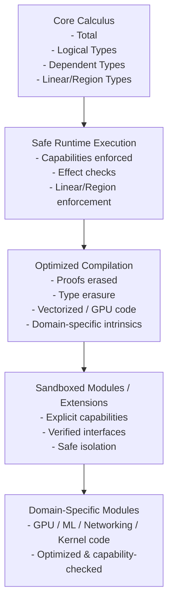
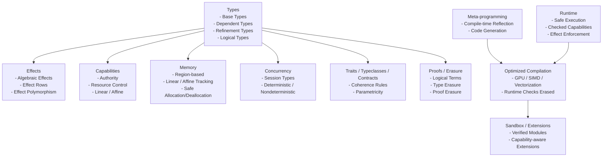
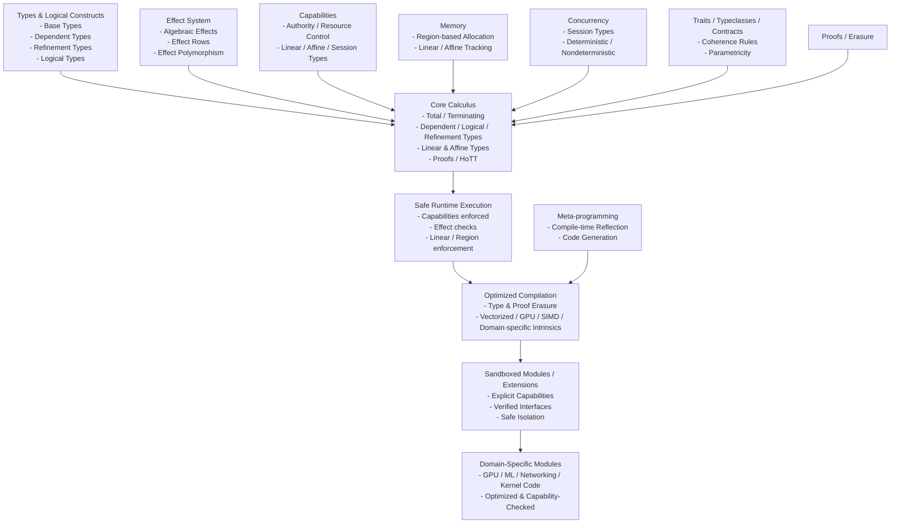

# Typed Capability Calculus Language (TCCL)
*A Stratified, Dependently Typed, Capability-Secure Systems Language*

---

# 1. Overview
[Table-of-contents](#table-of-contents)

TCCL is a research-grade programming language built around a single unifying principle:

> Everything effectful, authoritative, concurrent, or unsafe is represented as a typed capability.

It integrates:

- Type Level vs Value Level
- Total core + Turing-complete runtime stratification
- Memory safety (safe + unsafe separation)
- Capability Based inform effects
- Support Different Concurrency Models 
- Structured authority system
- Algebraic effects + handlers
- Session types for concurrency
- Contexts
- Intrinsic vs Extrinsic Typing
- Tactics
- Region-based memory
- Linear and affine types (Usage based)
- Dependent types
- Logical types
- Refinement types
- Traits / typeclasses / contracts
- Determinism tracking
- Verified FFI boundary
- Compile-time vs runtime phase separation
- Metaprogramming
- Metainformation (inline, hints, line number, column number, file, function, sttage of compilation, tactic hints)
- Type systems (dynamic, static, duck typing)
- Namespace graphs
- Language Directives
- Core Judgements (Inference rules)
- Proof relevance
- Category Theory
- Type erasure
- Proof erasure
- Parametricity guarantees
- Contextual equivalence model
- Cost semantics
- Capability revocation
- Universe hierarchy
- Graded / quantitative resource algebra
- Deterministic replay semantics
- Homotopy Type Theory (HoTT) layer using univalence and isomorphism

The system is built on a **Typed Capability Calculus (TCC)**.

---

# Diagrams
[Table-of-contents](#table-of-contents)

## TCCL Workflow Diagram
[Table-of-contents](#table-of-contents)



## TCCL Constructs Diagram
[Table-of-contents](#table-of-contents)



# 1. Unified TCCL Architecture Diagram
[Table-of-contents](#table-of-contents)



## 2. Roadmap Diagram
[Table-of-contents](#table-of-contents)



```mermaid
graph LR
    %% Phases of TCCL Research & Implementation
    Phase1[Foundational Design\n- Typed Capability Calculus\n- Core Calculus\n- Linear / Region Types\n- Effect System]
    Phase2[Formal Verification & Proofs\n- Soundness\n- Preservation & Progress\n- Erasure & Parametricity\n- Contextual Equivalence]
    Phase3[Runtime & Safe Execution\n- Checked Runtime\n- Capabilities Enforcement\n- Session Types\n- Region Memory Management]
    Phase4[Optimized Compilation\n- GPU / SIMD / Vectorization\n- Proof / Type Erasure\n- Domain-Specific Intrinsics]
    Phase5[Sandbox & Extensions\n- Verified Plugins\n- Capability-aware Modules\n- Safe Extensions]
    Phase6[Tooling & Ergonomics\n- Linters & Effect / Capability Inference\n- Meta-programming Support\n- IDE Visualizations]
    Phase7[Adoption & Domain Integration\n- ML / GPU / Networking / Kernel Libraries\n- Gradual Typing / Interop\n- Verified FFI / Safety Boundaries]

    %% Connections
    Phase1 --> Phase2 --> Phase3 --> Phase4 --> Phase5 --> Phase6 --> Phase7
```

## 3. TCCL Roadmap
[Table-of-contents](#table-of-contents)

### Foundational Design
[Table-of-contents](#table-of-contents)

- Define typed capability calculus (TCC)
- Implement core calculus with linear/affine types, dependent types, logical/refinement types
- Model capabilities, authority, and effect system

### Formal Verification
[Table-of-contents](#table-of-contents)

- Prove preservation, progress, and soundness
- Verify erasure, parametricity, and contextual equivalence
- Integrate optional HoTT reasoning

### Runtime and Safe Execution
[Table-of-contents](#table-of-contents)

- Implement capability-checked runtime
- Enforce effect system dynamically
- Session-type concurrency support
- Linear/region-based memory enforcement

### Optimized Compilation
[Table-of-contents](#table-of-contents)

- Add compile-time erasure (proofs/types)
- Generate vectorized / GPU / SIMD / domain-specific code
- Integrate meta-programming for optimized code generation

### Sandboxing and Extensions
[Table-of-contents](#table-of-contents)

- Verified, capability-aware plugin modules
- Safe isolation for untrusted code
- Modular domain-specific extensions

### Tooling and Ergonomics
[Table-of-contents](#table-of-contents)

- Linter and IDE support for capabilities, effects, determinism
- Visualizations for authority, session types, and memory regions
- Meta-programming assistance for code generation and verification

### Adoption and Domain Integration
[Table-of-contents](#table-of-contents)

- Build libraries for ML, networking, GPU, kernel programming
- Gradual typing and interop with other languages
- Verified FFI and safe runtime boundaries

---

# Table Of Contents

- [Core Typing Judgement]
- [Type Layers]
  - [Simple and Dependent Types]
  - [Logical Types]
  - [Refinement Types]
  - [Traits / Typeclasses / Contracts]
- [Authority]
  - [Everything is a Capability]
  - [No Ambient Authority]
  - [Capability Polymorphism]
  - [Capability Passing]
  - [Capability Revocation]
- [Imports and Authorities]
- [Context System]
  - [Linear Context Splitting]
  - [Context Creation]
  - [Context Restriction]
  - [Context Integrity]
- [Algebraic Effects]
- [Session Types]
- [Region-Based Memory]
- [Determinism and Replay]
- [Compile-Time vs Runtime]
- [Type Erasure]
- [Proof Erasure]
- [Cost Semantics]
- [Parametricity]
- [Contextual Equivalence]
- [Homotopy Type Theory]
- [Soundness Strategy]
- [Meta-Theoretic Safeguards]
- [Ergonomics]
- [Design Philosophy]
- [Summary]
- [Glossary](#Glossary)

---

# 2. Core Typing Judgment
[Table-of-contents](#table-of-contents)

The fundamental typing judgment is:

Γ ⊢ t : A ▷ ε ▷ κ ▷ ρ ▷ φ

Where:

- A   = value type
- ε   = effect row
- κ   = required capabilities
- ρ   = region/resource usage
- φ   = logical/refinement obligations

---

# 3. Type Layers
[Table-of-contents](#table-of-contents)

## 3.1 Simple and Dependent Types
[Table-of-contents](#table-of-contents)

A, B ::=
    Type₀ | Type₁ | Type₂ | ...
  | Π (x : A). B
  | Σ (x : A). B
  | A ⊸ B                   -- linear
  | A ⊣ B                   -- affine

Universe hierarchy prevents Girard’s paradox.

---

## 3.2 Logical Types
[Table-of-contents](#table-of-contents)

Prop : Type₀

Logical types live in World 0 (total).

Examples:

Sorted : List Int → Prop
SafeFFI : ForeignFunc → Prop
Deterministic : Term → Prop
CostBound : Term → Nat → Prop

Proofs are values inhabiting propositions:

Γ ⊢ p : P

Proofs:

- Must terminate
- Cannot perform effects
- Cannot access capabilities
- Are erased at runtime

---

## 3.3 Refinement Types
[Table-of-contents](#table-of-contents)

{x : A | P(x)}

Example:

Nat = {x : Int | x ≥ 0}

readPositive :
  (x : Int) →
  Eff {IO} {y : Int | y > 0}

Refinements are checked via:

- SMT integration
- Proof construction
- Sized-type reasoning
- Cost semantics

Refinements are erased after verification.

---

## 3.4 Traits / Typeclasses / Contracts
[Table-of-contents](#table-of-contents)

Traits:

trait Eq A {
  eq : A → A → Bool
}

Instance coherence rule:

> For any (Type, Trait) pair, at most one instance is visible in a scope.

Contracts extend traits with logical guarantees:

trait SortedContainer A {
  insert :
    (x : A) →
    {c : Self | Sorted(c)}
}

Contracts combine:
- Behavior
- Effects
- Refinements
- Capabilities

Contracts may include:

- Logical obligations
- Effect constraints
- Capability bounds
- Cost guarantees

Coherence rule:

> For any (Type, Trait) pair, at most one visible instance.

Instances may not escalate authority implicitly.

---

# 4. Authority System
[Table-of-contents](#table-of-contents)

## 4.1 Everything is a Capability
[Table-of-contents](#table-of-contents)

Authority is modeled explicitly:

Cap ::= FileRead
      | FileWrite
      | NetAccess
      | SpawnThread
      | UnsafeMem
      | Nondet
      | Deterministic
      | Region r
      | Session S
      | Cost n
      | Epoch e

Capabilities are values.
Capabilities are:

- Linear
- Affine
- Persistent
- Graded

---

## 4.2 No Ambient Authority
[Table-of-contents](#table-of-contents)

There is no global IO.
There is no implicit access.

Every function declares required capabilities:

All authority is explicit.

Functions declare capability requirements:

readFile :
  (path : String)
  →{FileRead}
  Eff {IO} String

---

## 4.3 Capability Polymorphism
[Table-of-contents](#table-of-contents)

∀ κ. f : A →{κ} B

Allows authority abstraction without over-constraining users.

---

## 4.3 Capability Passing
[Table-of-contents](#table-of-contents)

Capabilities must be passed explicitly:

main :
  (cap : FileRead)
  → Eff {IO} Unit

Refactoring remains easy because:

- Authority appears in type signatures.
- Removing authority removes capability parameters.
- Adding authority requires explicit modification.

No hidden global effects.

---

## 4.4 Capability Revocation
[Table-of-contents](#table-of-contents)

Revocation mechanisms:

1. Region-scoped capabilities
2. Epoch capabilities
3. Linear expiration tokens

Example:

grant :
  Cap → Epoch e → ScopedCap e

revoke :
  ScopedCap e → Void

Revocation ensures long-lived programs remain secure.

---

# 5. Imports and Authority
[Table-of-contents](#table-of-contents)

Imports are pure unless authority is declared.
Imports are authority-transparent.

```lang
import Math
import FileIO requires {FileRead}
import UnsafeMem unsafe
```

Modules declare:

```lang
module FileIO
  requires {FileRead}
```

This means:

- You cannot import FileIO unless your module also declares FileRead.
- Authority flows upward through module boundaries.

This makes refactoring safe:

- Removing FileRead from a module forces removal from children.
- Authority is structural and visible in signatures.


Authority must flow upward structurally.

Removing authority is mechanically enforced by the compiler.

---

# 6. Context System
[Table-of-contents](#table-of-contents)

Γ contains:

- Value bindings
- Capability bindings
- Region tokens
- Logical assumptions
- Trait instances
- Universe constraints

---

## 6.1 Linear Context Splitting
[Table-of-contents](#table-of-contents)

Γ = Γ₁ ⊗ Γ₂

Prevents duplication of linear resources.

---

## 6.2 Context Creation
[Table-of-contents](#table-of-contents)

region r {
  ...
}

Introduces r : RegionToken.

---

## 6.2 Context Restriction
[Table-of-contents](#table-of-contents)

```lang
restrict {FileRead} in {
  ...
}
```

Allows safe refactoring.

---

## 6.3 Context Integrity
[Table-of-contents](#table-of-contents)

You cannot:

- Forge capabilities
- Escalate without token
- Duplicate linear tokens
- Leak region tokens
- Introduce logical inconsistency

---

# 7. Algebraic Effects
[Table-of-contents](#table-of-contents)

Effect rows:

ε ::= {}
    | {IO}
    | {State}
    | {Spawn}
    | {Nondet}
    | {Cost}
    | ε ∪ ε

Effect polymorphism supported:

∀ ε. f : A → Eff ε B

Capabilities authorize effects.

---

# 8. Session Types
[Table-of-contents](#table-of-contents)

S ::= Send A; S
    | Recv A; S
    | End

Channels are linear capabilities.

Channels cannot be duplicated.

Session fidelity theorem:

Well-typed programs never deadlock due to protocol mismatch.

---

# 9. Region-Based Memory
[Table-of-contents](#table-of-contents)

Regions are linear capabilities.

```lang
region r {
  let x = alloc[r] 5
}
```

```lang
alloc :
  ∀ r. A → Region r A
```

No use-after-free.
No escape of region-scoped data.

---

# 10. Determinism and Replay
[Table-of-contents](#table-of-contents)

Determinism modeled as capability.

Deterministic code:
- Replayable
- Serializable
- Optimizable

Nondet requires explicit capability.

Deterministic replay semantics ensure distributed reproducibility.

---

# 11. Compile-Time vs Runtime
[Table-of-contents](#table-of-contents)

World 0:
- Total
- Logical
- Proofs
- Termination required

World 1:
- Effects
- IO
- Concurrency

World 2:
- Unsafe
- FFI

Proofs and type-only structures erased.

---

# 12. Type Erasure
[Table-of-contents](#table-of-contents)

After type checking, the program undergoes type erasure.

Erased:

- Type arguments
- Refinement predicates
- Trait dictionaries (if statically resolved)
- Phantom parameters
- Logical terms
- Universe annotations

Runtime representation retains:

- Data
- Capabilities
- Effectful constructs
- Linear resources
- Region tokens

Erasure preserves operational semantics.

Formal guarantee:

If Γ ⊢ t : A and t → t'

Then erase(t) → erase(t').

Preservation theorem:

erase(t) simulates t.

---

# 13. Proof Erasure
[Table-of-contents](#table-of-contents)

Proofs:

- Exist only in total world 
- Cannot observe runtime
- Are erased
- Exist only in World 0
- Cannot perform effects
- Must terminate

All proofs are erased before runtime.

Example:

```lang
f :
  (x : Int)
  → (p : x ≥ 0)
  → Nat
```

At runtime:

```lang
f :
  Int → Int
```

Proof argument removed.

Soundness guarantee:

Proof erasure does not alter runtime behavior.

Erasure does not change observable behavior.

---

# 14. Cost Semantics
[Table-of-contents](#table-of-contents)

Cost integrated into type system.

Example:

```lang
f :
  A → {x : B | cost(x) ≤ n}
```

Cost capability:

Cost n

Graded linear algebra supports resource budgets.

---

# 15. Parametricity
[Table-of-contents](#table-of-contents)

Relational parametricity theorem ensures:

- Representation independence
- Free theorems
- Refactor safety

Abstraction boundaries are semantically enforced.

---

# 16. Contextual Equivalence
[Table-of-contents](#table-of-contents)

Define contextual equivalence:
```lang
t₁ ≈ t₂ iff
For all contexts C,
C[t₁] and C[t₂] are observationally indistinguishable.
```

Used to prove:

- Optimization correctness
- Erasure soundness
- Refactoring safety

---

# 17. Homotopy Type Theory (Optional Layer)
[Table-of-contents](#table-of-contents)

HoTT can be integrated in World 0.

Add:

Identity types as paths.
Univalence axiom (optional, restricted).

Benefits:

- Equality as equivalence
- Safe substitution via path transport
- Structured contextual equivalence reasoning
- Higher-level abstraction guarantees

However:

HoTT must remain isolated from runtime effects.

No capability tokens allowed inside HoTT layer.

Univalence must not affect runtime computation.

HoTT is compile-time only and erased.

---

# 14. Verified FFI Boundary
[Table-of-contents](#table-of-contents)

```lang
Foreign import requires proof:

foreign import c_sin :
  Float → Float
  requires p : SafeFFI c_sin
```

Unsafe FFI requires UnsafeMem capability.

Proof erased.
Safety checked at compile-time.

---

# 18. Soundness Strategy
[Table-of-contents](#table-of-contents)

We prove:

1. Preservation
2. Progress
3. Linear soundness
4. Region safety
5. Session fidelity
6. Capability safety
7. Determinism preservation
8. Refinement preservation
9. Strong normalization (World 0)
10. Erasure preservation
11. Parametricity theorem
12. Contextual equivalence stability

Erasure theorem:

If Γ ⊢ t : A and t → t'

Then erase(t) →* erase(t').

No proof or type term affects runtime semantics.


---

# 19. Meta-Theoretic Safeguards
[Table-of-contents](#table-of-contents)

- Universe hierarchy
- Logical/runtime separation
- No reflection from runtime into Prop
- Capability-free logical layer
- Termination checking via sized types

---

# 23. Optimized Compilation Workflow
[Table-of-contents](#table-of-contents)

TCCL supports **high-performance, domain-specific compilation** without sacrificing safety.

## Workflow
[Table-of-contents](#table-of-contents)

### Safe Runtime Execution
[Table-of-contents](#table-of-contents)

- Run code with full capabilities, proof obligations, effect checks, and linear/region enforcement.
- Guarantees correctness and determinism.

```lang
fn safe_sum(xs: List Int) → Int
    requires {IO}
    ensures { cost ≤ length(xs) } 
{
    fold(xs, 0, |acc, x| acc + x)
}
```

### Meta-programming / Code Generation
[Table-of-contents](#table-of-contents)

Use compile-time reflection and metaprogramming to generate optimized code.

Infers memory layout, vectorization, GPU kernels, and unrolled loops.

```lang
@compile_optimized
fn fast_sum(xs: List Int) → Int {
    // Compiler replaces fold with unrolled vectorized code
}
```

### Ahead-of-Time / Just-in-Time Compilation
[Table-of-contents](#table-of-contents)

Verified code can be compiled to native machine code.

Proofs, refinement types, and runtime checks are erased.

Linear, affine, and region guarantees remain statically enforced.

This allows programs to run with peak performance while preserving all core calculus invariants.

# 24. Sandboxing and Safe Extensions
[Table-of-contents](#table-of-contents)

TCCL supports sandboxed execution and modular extensions.

## Sandboxing
[Table-of-contents](#table-of-contents)

- Each module or runtime session can have explicit capabilities.
- Capabilities control authority and effects, preventing unsafe behavior from leaking.

```lang
sandboxed fn run_plugin(plugin: Plugin) requires {FileRead, NetAccess} {
    plugin.run()
}
```

- Untrusted code must declare required capabilities.
- Runtime enforces capability constraints.

Extensions
- Domain-specific functionality (GPU, SIMD, ML, networking) is added as capability-aware modules.

```lang
module GPUOps using GPUCap {
    tensor_add : Tensor Float → Tensor Float → Tensor Float
    tensor_mul : Tensor Float → Tensor Float → Tensor Float
}
```

- Modules are fully verified in type signatures.
- Core calculus only sees typed capability interfaces, not unsafe internals.

---

# 20. Ergonomics
[Table-of-contents](#table-of-contents)

- Effect inference
- Capability inference
- Region inference
- Cost inference
- Refinement inference
- Capability visualization
- Effect graph
- Determinism map
- Erasure preview
- Authority audit trail

Gradual modes allow prototype → verified progression.

---

## 16.1 Inference
[Table-of-contents](#table-of-contents)

- Effect inference
- Capability inference
- Region inference
- Refinement inference

---

## 16.2 Defaults
[Table-of-contents](#table-of-contents)

- Pure by default
- Deterministic by default
- No authority by default

---

## 16.3 Refactor Safety
[Table-of-contents](#table-of-contents)

Because authority appears in signatures:

- Removing IO changes types.
- Compiler identifies all dependencies.
- No hidden global state.

---

## 16.4 Tooling

IDE support:

- Capability graph visualization
- Effect graph
- Region lifetime graph
- Session protocol diagram
- Refinement obligation tracker
- Erasure preview (compile-time vs runtime diff)

---

# 21. Design Philosophy
[Table-of-contents](#table-of-contents)

The language guarantees:

- No authority without capability
- No effect without authorization
- No resource leak
- No protocol mismatch
- No unsound FFI
- No hidden nondeterminism
- No logical inconsistency
- No runtime cost from proofs
- No unsound substitution
- No abstraction leakage

Everything explicit.
Everything typed.
Everything compositional.
Everything erasable where safe.

Key Principles

Explicit authority: Sandbox modules cannot access more than declared capabilities.

Safe erasure: Proofs, logical terms, and refinement checks removed at runtime or compilation.

Composable optimizations: Optimized modules can replace safe core code transparently.

Refactorable and deterministic: Even after optimization or sandboxing, code remains safe, deterministic, and compatible with type and capability inference.

Sandboxing + capability-aware extensions let TCCL achieve perfect expressiveness while allowing high-performance, domain-specific execution, all without compromising the foundational guarantees.

---

# 22. Summary
[Table-of-contents](#table-of-contents)

TCCL is a stratified, dependently typed, capability-secure calculus
integrating:

- Authority control
- Effect systems
- Session concurrency
- Region memory
- Determinism tracking
- Logical reasoning
- Refinement types
- Traits and contracts
- Cost semantics
- Parametricity
- Contextual equivalence
- Type and proof erasure
- Optional HoTT reasoning layer

It is designed for:

- Secure systems programming
- Verified software
- Deterministic distributed systems
- Capability-secure architectures
- Foundational programming language research

---

# Glossary
[Table of Contents](#table-of-contents)

| Term                                  | Definitions |
|---------------------------------------|-------------|
| A | |
| B | | 
| C | |
| Categories | |
| Cartesian Closed Categories (CCC) | Corresponds to typical simply typed lambda calculus along with functions as well as tuples (products) and tagged unions (disjoint sums) |
| Monoidal Categories               | Capabilities + Linear Constraints |
| Categories with Families (CWF)    | Practical Computational Model |
| Presheaf / Cubical                | Practical Computational Model (Cubical HoTT) |
| Cubical Monoidal CWF              | Good target |
| ∞-groupoid categories             | largest category, fully capture HoTT semantics. However, this is not constructive |
| D || 
| E || 
| F || 
| G || 
| H || 
| I || 
| J || 
| K || 
| L || 
| M || 
| N || 
| O || 
| P || 
| Q || 
| R || 
| S || 
| T || 
| U || 
| V || 
| W || 
| X || 
| Y || 
| Z || 

