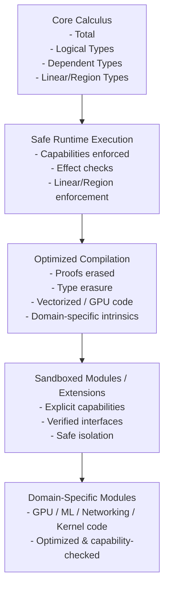
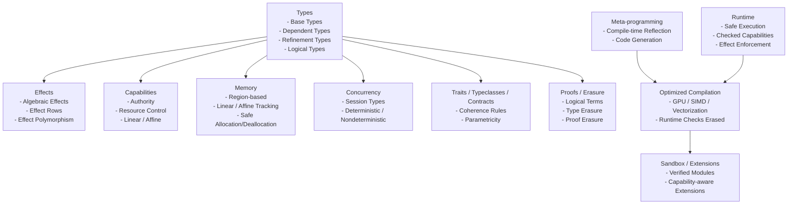
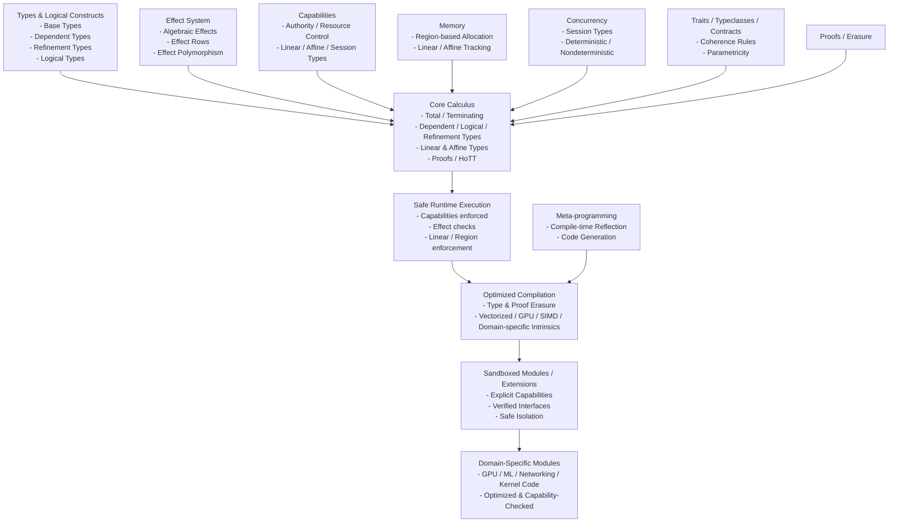

# Typed Capability Calculus Language (TCCL)
*A Stratified, Dependently Typed, Capability-Secure Systems Language*

---

# 1. Overview
[Table-of-contents](#table-of-contents)

TCCL is a research-grade programming language built around a single unifying principle:

> Everything effectful, authoritative, concurrent, or unsafe is represented as a typed capability.

It integrates:

- Type Level vs Value Level
- Total core + Turing-complete runtime stratification
- Memory safety (safe + unsafe separation)
- Capability Based inform effects
- Support Different Concurrency Models 
- Structured authority system
- Algebraic effects + handlers
- Session types for concurrency
- Contexts
- Intrinsic vs Extrinsic Typing
- Tactics
- Region-based memory
- Linear and affine types (Usage based)
- Dependent types
- Logical types
- Refinement types
- Traits / Typeclasses / Contracts / INTERFACES
- Determinism tracking
- Verified FFI boundary
- Compile-time vs runtime phase separation
- Metaprogramming
- Metainformation (inline, hints, line number, column number, file, function, sttage of compilation, tactic hints)
- Type systems (dynamic, static, duck typing)
- Namespace graphs
- Language Directives
- Core Judgements (Inference rules)
- Proof relevance
- Category Theory
- Type erasure
- Proof erasure
- Parametricity guarantees
- Contextual equivalence model
- Cost semantics
- Capability revocation
- Universe hierarchy
- Graded / quantitative resource algebra
- Deterministic replay semantics
- Homotopy Type Theory (HoTT) layer using univalence and isomorphism

The system is built on a **Typed Capability Calculus (TCC)**.

---

# Diagrams
[Table-of-contents](#table-of-contents)

## TCCL Workflow Diagram
[Table-of-contents](#table-of-contents)



## TCCL Constructs Diagram
[Table-of-contents](#table-of-contents)



# 1. Unified TCCL Architecture Diagram
[Table-of-contents](#table-of-contents)



## 2. Roadmap Diagram
[Table-of-contents](#table-of-contents)



```mermaid
graph LR
    %% Phases of TCCL Research & Implementation
    Phase1[Foundational Design\n- Typed Capability Calculus\n- Core Calculus\n- Linear / Region Types\n- Effect System]
    Phase2[Formal Verification & Proofs\n- Soundness\n- Preservation & Progress\n- Erasure & Parametricity\n- Contextual Equivalence]
    Phase3[Runtime & Safe Execution\n- Checked Runtime\n- Capabilities Enforcement\n- Session Types\n- Region Memory Management]
    Phase4[Optimized Compilation\n- GPU / SIMD / Vectorization\n- Proof / Type Erasure\n- Domain-Specific Intrinsics]
    Phase5[Sandbox & Extensions\n- Verified Plugins\n- Capability-aware Modules\n- Safe Extensions]
    Phase6[Tooling & Ergonomics\n- Linters & Effect / Capability Inference\n- Meta-programming Support\n- IDE Visualizations]
    Phase7[Adoption & Domain Integration\n- ML / GPU / Networking / Kernel Libraries\n- Gradual Typing / Interop\n- Verified FFI / Safety Boundaries]

    %% Connections
    Phase1 --> Phase2 --> Phase3 --> Phase4 --> Phase5 --> Phase6 --> Phase7
```

## 3. TCCL Roadmap
[Table-of-contents](#table-of-contents)

### Foundational Design
[Table-of-contents](#table-of-contents)

- Define typed capability calculus (TCC)
- Implement core calculus with linear/affine types, dependent types, logical/refinement types
- Model capabilities, authority, and effect system

### Formal Verification
[Table-of-contents](#table-of-contents)

- Prove preservation, progress, and soundness
- Verify erasure, parametricity, and contextual equivalence
- Integrate optional HoTT reasoning

### Runtime and Safe Execution
[Table-of-contents](#table-of-contents)

- Implement capability-checked runtime
- Enforce effect system dynamically
- Session-type concurrency support
- Linear/region-based memory enforcement

### Optimized Compilation
[Table-of-contents](#table-of-contents)

- Add compile-time erasure (proofs/types)
- Generate vectorized / GPU / SIMD / domain-specific code
- Integrate meta-programming for optimized code generation

### Sandboxing and Extensions
[Table-of-contents](#table-of-contents)

- Verified, capability-aware plugin modules
- Safe isolation for untrusted code
- Modular domain-specific extensions

### Tooling and Ergonomics
[Table-of-contents](#table-of-contents)

- Linter and IDE support for capabilities, effects, determinism
- Visualizations for authority, session types, and memory regions
- Meta-programming assistance for code generation and verification

### Adoption and Domain Integration
[Table-of-contents](#table-of-contents)

- Build libraries for ML, networking, GPU, kernel programming
- Gradual typing and interop with other languages
- Verified FFI and safe runtime boundaries

---

# Table Of Contents

- [Core Typing Judgement]
- [Type Layers]
  - [Simple and Dependent Types]
  - [Logical Types]
  - [Refinement Types]
  - [Traits / Typeclasses / Contracts]
- [Authority]
  - [Everything is a Capability]
  - [No Ambient Authority]
  - [Capability Polymorphism]
  - [Capability Passing]
  - [Capability Revocation]
- [Imports and Authorities]
- [Context System]
  - [Linear Context Splitting]
  - [Context Creation]
  - [Context Restriction]
  - [Context Integrity]
- [Algebraic Effects]
- [Session Types]
- [Region-Based Memory]
- [Determinism and Replay]
- [Compile-Time vs Runtime]
- [Type Erasure]
- [Proof Erasure]
- [Cost Semantics]
- [Parametricity]
- [Contextual Equivalence]
- [Homotopy Type Theory]
- [Soundness Strategy]
- [Meta-Theoretic Safeguards]
- [Ergonomics]
- [Design Philosophy]
- [Summary]
- [API](#api)
- [Ideas](#ideas)
- [Categories](#categories)
- [Glossary](#Glossary)

---

# 2. Core Typing Judgment
[Table-of-contents](#table-of-contents)

The fundamental typing judgment is:

Γ ⊢ t : A ▷ ε ▷ κ ▷ ρ ▷ φ

Where:

- A   = value type
- ε   = effect row
- κ   = required capabilities
- ρ   = region/resource usage
- φ   = logical/refinement obligations

---

# 3. Type Layers
[Table-of-contents](#table-of-contents)

## 3.1 Simple and Dependent Types
[Table-of-contents](#table-of-contents)

A, B ::=
    Type₀ | Type₁ | Type₂ | ...
  | Π (x : A). B
  | Σ (x : A). B
  | A ⊸ B                   -- linear
  | A ⊣ B                   -- affine

Universe hierarchy prevents Girard’s paradox.

---

## 3.2 Logical Types
[Table-of-contents](#table-of-contents)

Prop : Type₀

Logical types live in World 0 (total).

Examples:

Sorted : List Int → Prop
SafeFFI : ForeignFunc → Prop
Deterministic : Term → Prop
CostBound : Term → Nat → Prop

Proofs are values inhabiting propositions:

Γ ⊢ p : P

Proofs:

- Must terminate
- Cannot perform effects
- Cannot access capabilities
- Are erased at runtime

---

## 3.3 Refinement Types
[Table-of-contents](#table-of-contents)

{x : A | P(x)}

Example:

Nat = {x : Int | x ≥ 0}

readPositive :
  (x : Int) →
  Eff {IO} {y : Int | y > 0}

Refinements are checked via:

- SMT integration
- Proof construction
- Sized-type reasoning
- Cost semantics

Refinements are erased after verification.

---

## 3.4 Traits / Typeclasses / Contracts
[Table-of-contents](#table-of-contents)

Traits:

trait Eq A {
  eq : A → A → Bool
}

Instance coherence rule:

> For any (Type, Trait) pair, at most one instance is visible in a scope.

Contracts extend traits with logical guarantees:

trait SortedContainer A {
  insert :
    (x : A) →
    {c : Self | Sorted(c)}
}

Contracts combine:
- Behavior
- Effects
- Refinements
- Capabilities

Contracts may include:

- Logical obligations
- Effect constraints
- Capability bounds
- Cost guarantees

Coherence rule:

> For any (Type, Trait) pair, at most one visible instance.

Instances may not escalate authority implicitly.

---

# 4. Authority System
[Table-of-contents](#table-of-contents)

## 4.1 Everything is a Capability
[Table-of-contents](#table-of-contents)

Authority is modeled explicitly:

Cap ::= FileRead
      | FileWrite
      | NetAccess
      | SpawnThread
      | UnsafeMem
      | Nondet
      | Deterministic
      | Region r
      | Session S
      | Cost n
      | Epoch e

Capabilities are values.
Capabilities are:

- Linear
- Affine
- Persistent
- Graded

---

## 4.2 No Ambient Authority
[Table-of-contents](#table-of-contents)

There is no global IO.
There is no implicit access.

Every function declares required capabilities:

All authority is explicit.

Functions declare capability requirements:

readFile :
  (path : String)
  →{FileRead}
  Eff {IO} String

---

## 4.3 Capability Polymorphism
[Table-of-contents](#table-of-contents)

∀ κ. f : A →{κ} B

Allows authority abstraction without over-constraining users.

---

## 4.3 Capability Passing
[Table-of-contents](#table-of-contents)

Capabilities must be passed explicitly:

main :
  (cap : FileRead)
  → Eff {IO} Unit

Refactoring remains easy because:

- Authority appears in type signatures.
- Removing authority removes capability parameters.
- Adding authority requires explicit modification.

No hidden global effects.

---

## 4.4 Capability Revocation
[Table-of-contents](#table-of-contents)

Revocation mechanisms:

1. Region-scoped capabilities
2. Epoch capabilities
3. Linear expiration tokens

Example:

grant :
  Cap → Epoch e → ScopedCap e

revoke :
  ScopedCap e → Void

Revocation ensures long-lived programs remain secure.

---

# 5. Imports and Authority
[Table-of-contents](#table-of-contents)

Imports are pure unless authority is declared.
Imports are authority-transparent.

```lang
import Math
import FileIO requires {FileRead}
import UnsafeMem unsafe
```

Modules declare:

```lang
module FileIO
  requires {FileRead}
```

This means:

- You cannot import FileIO unless your module also declares FileRead.
- Authority flows upward through module boundaries.

This makes refactoring safe:

- Removing FileRead from a module forces removal from children.
- Authority is structural and visible in signatures.


Authority must flow upward structurally.

Removing authority is mechanically enforced by the compiler.

---

# 6. Context System
[Table-of-contents](#table-of-contents)

Γ contains:

- Value bindings
- Capability bindings
- Region tokens
- Logical assumptions
- Trait instances
- Universe constraints

---

## 6.1 Linear Context Splitting
[Table-of-contents](#table-of-contents)

Γ = Γ₁ ⊗ Γ₂

Prevents duplication of linear resources.

---

## 6.2 Context Creation
[Table-of-contents](#table-of-contents)

region r {
  ...
}

Introduces r : RegionToken.

---

## 6.2 Context Restriction
[Table-of-contents](#table-of-contents)

```lang
restrict {FileRead} in {
  ...
}
```

Allows safe refactoring.

---

## 6.3 Context Integrity
[Table-of-contents](#table-of-contents)

You cannot:

- Forge capabilities
- Escalate without token
- Duplicate linear tokens
- Leak region tokens
- Introduce logical inconsistency

---

# 7. Algebraic Effects
[Table-of-contents](#table-of-contents)

Effect rows:

ε ::= {}
    | {IO}
    | {State}
    | {Spawn}
    | {Nondet}
    | {Cost}
    | ε ∪ ε

Effect polymorphism supported:

∀ ε. f : A → Eff ε B

Capabilities authorize effects.

---

# 8. Session Types
[Table-of-contents](#table-of-contents)

S ::= Send A; S
    | Recv A; S
    | End

Channels are linear capabilities.

Channels cannot be duplicated.

Session fidelity theorem:

Well-typed programs never deadlock due to protocol mismatch.

---

# 9. Region-Based Memory
[Table-of-contents](#table-of-contents)

Regions are linear capabilities.

```lang
region r {
  let x = alloc[r] 5
}
```

```lang
alloc :
  ∀ r. A → Region r A
```

No use-after-free.
No escape of region-scoped data.

---

# 10. Determinism and Replay
[Table-of-contents](#table-of-contents)

Determinism modeled as capability.

Deterministic code:
- Replayable
- Serializable
- Optimizable

Nondet requires explicit capability.

Deterministic replay semantics ensure distributed reproducibility.

---

# 11. Compile-Time vs Runtime
[Table-of-contents](#table-of-contents)

World 0:
- Total
- Logical
- Proofs
- Termination required

World 1:
- Effects
- IO
- Concurrency

World 2:
- Unsafe
- FFI

Proofs and type-only structures erased.

---

# 12. Type Erasure
[Table-of-contents](#table-of-contents)

After type checking, the program undergoes type erasure.

Erased:

- Type arguments
- Refinement predicates
- Trait dictionaries (if statically resolved)
- Phantom parameters
- Logical terms
- Universe annotations

Runtime representation retains:

- Data
- Capabilities
- Effectful constructs
- Linear resources
- Region tokens

Erasure preserves operational semantics.

Formal guarantee:

If Γ ⊢ t : A and t → t'

Then erase(t) → erase(t').

Preservation theorem:

erase(t) simulates t.

---

# 13. Proof Erasure
[Table-of-contents](#table-of-contents)

Proofs:

- Exist only in total world 
- Cannot observe runtime
- Are erased
- Exist only in World 0
- Cannot perform effects
- Must terminate

All proofs are erased before runtime.

Example:

```lang
f :
  (x : Int)
  → (p : x ≥ 0)
  → Nat
```

At runtime:

```lang
f :
  Int → Int
```

Proof argument removed.

Soundness guarantee:

Proof erasure does not alter runtime behavior.

Erasure does not change observable behavior.

---

# 14. Cost Semantics
[Table-of-contents](#table-of-contents)

Cost integrated into type system.

Example:

```lang
f :
  A → {x : B | cost(x) ≤ n}
```

Cost capability:

Cost n

Graded linear algebra supports resource budgets.

---

# 15. Parametricity
[Table-of-contents](#table-of-contents)

Relational parametricity theorem ensures:

- Representation independence
- Free theorems
- Refactor safety

Abstraction boundaries are semantically enforced.

---

# 16. Contextual Equivalence
[Table-of-contents](#table-of-contents)

Define contextual equivalence:
```lang
t₁ ≈ t₂ iff
For all contexts C,
C[t₁] and C[t₂] are observationally indistinguishable.
```

Used to prove:

- Optimization correctness
- Erasure soundness
- Refactoring safety

---

# 17. Homotopy Type Theory (Optional Layer)
[Table-of-contents](#table-of-contents)

HoTT can be integrated in World 0.

Add:

Identity types as paths.
Univalence axiom (optional, restricted).

Benefits:

- Equality as equivalence
- Safe substitution via path transport
- Structured contextual equivalence reasoning
- Higher-level abstraction guarantees

However:

HoTT must remain isolated from runtime effects.

No capability tokens allowed inside HoTT layer.

Univalence must not affect runtime computation.

HoTT is compile-time only and erased.

---

# 14. Verified FFI Boundary
[Table-of-contents](#table-of-contents)

```lang
Foreign import requires proof:

foreign import c_sin :
  Float → Float
  requires p : SafeFFI c_sin
```

Unsafe FFI requires UnsafeMem capability.

Proof erased.
Safety checked at compile-time.

---

# 18. Soundness Strategy
[Table-of-contents](#table-of-contents)

We prove:

1. Preservation
2. Progress
3. Linear soundness
4. Region safety
5. Session fidelity
6. Capability safety
7. Determinism preservation
8. Refinement preservation
9. Strong normalization (World 0)
10. Erasure preservation
11. Parametricity theorem
12. Contextual equivalence stability

Erasure theorem:

If Γ ⊢ t : A and t → t'

Then erase(t) →* erase(t').

No proof or type term affects runtime semantics.


---

# 19. Meta-Theoretic Safeguards
[Table-of-contents](#table-of-contents)

- Universe hierarchy
- Logical/runtime separation
- No reflection from runtime into Prop
- Capability-free logical layer
- Termination checking via sized types

---

# 23. Optimized Compilation Workflow
[Table-of-contents](#table-of-contents)

TCCL supports **high-performance, domain-specific compilation** without sacrificing safety.

## Workflow
[Table-of-contents](#table-of-contents)

### Safe Runtime Execution
[Table-of-contents](#table-of-contents)

- Run code with full capabilities, proof obligations, effect checks, and linear/region enforcement.
- Guarantees correctness and determinism.

```lang
fn safe_sum(xs: List Int) → Int
    requires {IO}
    ensures { cost ≤ length(xs) } 
{
    fold(xs, 0, |acc, x| acc + x)
}
```

### Meta-programming / Code Generation
[Table-of-contents](#table-of-contents)

Use compile-time reflection and metaprogramming to generate optimized code.

Infers memory layout, vectorization, GPU kernels, and unrolled loops.

```lang
@compile_optimized
fn fast_sum(xs: List Int) → Int {
    // Compiler replaces fold with unrolled vectorized code
}
```

### Ahead-of-Time / Just-in-Time Compilation
[Table-of-contents](#table-of-contents)

Verified code can be compiled to native machine code.

Proofs, refinement types, and runtime checks are erased.

Linear, affine, and region guarantees remain statically enforced.

This allows programs to run with peak performance while preserving all core calculus invariants.

# 24. Sandboxing and Safe Extensions
[Table-of-contents](#table-of-contents)

TCCL supports sandboxed execution and modular extensions.

## Sandboxing
[Table-of-contents](#table-of-contents)

- Each module or runtime session can have explicit capabilities.
- Capabilities control authority and effects, preventing unsafe behavior from leaking.

```lang
sandboxed fn run_plugin(plugin: Plugin) requires {FileRead, NetAccess} {
    plugin.run()
}
```

- Untrusted code must declare required capabilities.
- Runtime enforces capability constraints.

Extensions
- Domain-specific functionality (GPU, SIMD, ML, networking) is added as capability-aware modules.

```lang
module GPUOps using GPUCap {
    tensor_add : Tensor Float → Tensor Float → Tensor Float
    tensor_mul : Tensor Float → Tensor Float → Tensor Float
}
```

- Modules are fully verified in type signatures.
- Core calculus only sees typed capability interfaces, not unsafe internals.

---

# 20. Ergonomics
[Table-of-contents](#table-of-contents)

- Effect inference
- Capability inference
- Region inference
- Cost inference
- Refinement inference
- Capability visualization
- Effect graph
- Determinism map
- Erasure preview
- Authority audit trail

Gradual modes allow prototype → verified progression.

---

## 16.1 Inference
[Table-of-contents](#table-of-contents)

- Effect inference
- Capability inference
- Region inference
- Refinement inference

---

## 16.2 Defaults
[Table-of-contents](#table-of-contents)

- Pure by default
- Deterministic by default
- No authority by default

---

## 16.3 Refactor Safety
[Table-of-contents](#table-of-contents)

Because authority appears in signatures:

- Removing IO changes types.
- Compiler identifies all dependencies.
- No hidden global state.

---

## 16.4 Tooling

IDE support:

- Capability graph visualization
- Effect graph
- Region lifetime graph
- Session protocol diagram
- Refinement obligation tracker
- Erasure preview (compile-time vs runtime diff)

---

# 21. Design Philosophy
[Table-of-contents](#table-of-contents)

The language guarantees:

- No authority without capability
- No effect without authorization
- No resource leak
- No protocol mismatch
- No unsound FFI
- No hidden nondeterminism
- No logical inconsistency
- No runtime cost from proofs
- No unsound substitution
- No abstraction leakage

Everything explicit.
Everything typed.
Everything compositional.
Everything erasable where safe.

Key Principles

Explicit authority: Sandbox modules cannot access more than declared capabilities.

Safe erasure: Proofs, logical terms, and refinement checks removed at runtime or compilation.

Composable optimizations: Optimized modules can replace safe core code transparently.

Refactorable and deterministic: Even after optimization or sandboxing, code remains safe, deterministic, and compatible with type and capability inference.

Sandboxing + capability-aware extensions let TCCL achieve perfect expressiveness while allowing high-performance, domain-specific execution, all without compromising the foundational guarantees.

---

# 22. Summary
[Table-of-contents](#table-of-contents)

TCCL is a stratified, dependently typed, capability-secure calculus
integrating:

- Authority control
- Effect systems
- Session concurrency
- Region memory
- Determinism tracking
- Logical reasoning
- Refinement types
- Traits and contracts
- Cost semantics
- Parametricity
- Contextual equivalence
- Type and proof erasure
- Optional HoTT reasoning layer

It is designed for:

- Secure systems programming
- Verified software
- Deterministic distributed systems
- Capability-secure architectures
- Foundational programming language research

---

# API
[Table of Contents](#table-of-contents)

- Environments
- Contexts
- Namespaces
- Types
- Values
- Functions
- Expression

## Object Notation

Environment {
  create_module(name)
  create_type(name)
  create_function(name)

  inspect(object)
  evaluate(expr)

  search(symbol)
  refactors()
}

Object {
  send(message, args)
  methods()
  fields()
}
Operations:

add_method(object, method)
remove_method(object, name)
inspect(object)
This allows tools to modify programs dynamically.

2. Code Structure API (AST / IR access)
Instead of manipulating text, the environment manipulates program structure.

Example:

Program
Module
Class
Method
Expression
API:

create_method(class, name, ast)
modify_expression(node, new_expr)
rename_symbol(symbol, name)
This is what modern systems call structural editing.

3. Environment Introspection API
The environment can inspect itself.

Example:

list_classes()
find_method(name)
who_calls(method)
browse_references(symbol)
This enables:

code browsers

refactoring tools

live debugging

Smalltalk environments were famous for this.

4. Tool API
Editors, inspectors, debuggers, and visualizers are just programs using the environment API.

Example:

Tool {
  open_view(object)
  inspect(object)
  modify(ast)
}
Tools are first-class objects in the system.

5. Live Evaluation API
Programs can be modified while running.

Example:

evaluate(expression)
compile_method(class, code)
reload(module)
Example workflow:

edit method
compile
object immediately uses new behavior
This is live programming.

3. The Environment Object Model
A good way to structure this API is:

Environment
 ├── Objects
 ├── Code
 ├── Tools
 ├── Processes
 └── UI
Example interface:

Environment {
  objects()
  modules()
  tools()
  processes()
}
4. Structural Editing Instead of Text
Kay believed editing should manipulate program structure directly, not strings.

Example:

Instead of:

def add(x,y):
  x+y
The environment stores:

Function
  name: add
  args: [x,y]
  body:
    Add(x,y)
API:

create_function(name)
add_parameter(fn, name)
set_body(fn, ast)
This avoids parsing errors and enables powerful tools.

5. Message-Based APIs
Following Kay’s philosophy, environment APIs should be message protocols.

Example:

send(environment, "create-class", name)
send(class, "add-method", method)
send(object, "inspect")
Everything becomes a uniform messaging interface.

6. Versioned Object World
A real environment must support snapshots of the entire system.

Example API:

snapshot()
restore(snapshot)
diff(snapshot1, snapshot2)
This replaces file-based versioning.

7. Visual Tools as First-Class Programs
The environment should allow tools like:

inspectors

debuggers

code browsers

visualizers

Example:

Inspector.open(object)
Debugger.attach(process)
Browser.search("parse")

4. The System Is More Like a Database

Another good analogy is a program database.

Example operations:

insert_method
update_ast
query_references
delete_symbol


So the environment behaves like:

Program State + Queries + Transformations

5. The Best Existing API Model

The closest modern system to what you want is the Language Server Protocol (LSP) used by editors.

Example:

textDocument/definition
textDocument/references
workspace/symbol


But LSP is still limited because it mainly analyzes text, not a live object system.

6. Better Model: Stateful Session API

Your environment should use stateful sessions.

Conceptually:

client → session → environment


Example protocol:

session.start()

session.create_module("json")

session.create_function("parse")

session.evaluate("parse('{...}')")

session.inspect(object)


The environment maintains state during the session.

7. A Clean Formal Model

You can define the environment as:

Environment = (State, Operations)


Where:

State = ObjectGraph + ProgramStructure + Processes


Operations mutate the state:

op : State → State


Example:

add_method : State × Class × Method → State

8. Event-Based Architecture

Another good approach is event sourcing.

All changes are events:

AddClass
AddMethod
ModifyAST
EvaluateExpression
StartProcess


State becomes:

State = fold(events)


This is powerful for environments because it enables:

undo

replay

history

9. Real Architecture of a Live Programming Environment

Your environment will probably expose APIs for:

Objects
Code structure
Execution
Tools
History


Example interface:

Environment
  createType
  createFunction
  modifyAST
  evaluate
  inspect
  runProcess


All of these mutate the environment state.

10. One Key Design Insight

The system should look like this:

Client
  ↓
Environment Protocol
  ↓
Live Object World


Not like this:

Client
  ↓
REST API
  ↓
Server


Because your language environment is the world, not a web service.

✅ In short

Your programming environment should expose a stateful message protocol, not a REST API.

A good conceptual model is:

Environment = Object System + Code Database + Live Runtime


interacted with through message-based operations.

##

---

# Ideas
[Table of Contents](#table-of-contents)

- Alan Kay's vision of programming means need reflection on entire system, programming language api, capability and object representation (context representation).

---

# Categories
[Table of Contents](#table-of-contents)

## Foundations of Programming Languages

Concepts that define the mathematical or semantic foundations of programming.

### Mathematical / Logical Foundations

#### [Proof / Logic Concepts]
Logical systems used to reason about programs (propositional logic, predicate logic, type theory, Curry–Howard correspondence).

#### [Mathematical / Logic Programming Techniques]
Programming styles derived from formal logic or mathematics (logic programming, constraint programming, relational programming).

#### [Advanced Mathematical Programming Concepts]
Advanced theory used in languages (category theory, domain theory, denotational semantics, lattice theory).

## 2. Type Systems and Correctness

Concepts related to types, guarantees, and reasoning about programs.

### Core Type System Concepts

#### [Advanced Data Type Techniques]
Rich data abstractions like algebraic data types, GADTs, existential types, dependent pairs.

#### [Polymorphism Variants]
Mechanisms allowing generic code (parametric, ad-hoc, subtype, row polymorphism, etc.).

#### [Advanced Type System Techniques]
Sophisticated typing mechanisms (dependent types, higher-kinded types, linear types, refinement types).

### Type & Logic Integration

#### [Advanced Type / Logic Techniques]
Systems where logic and typing interact (proof-carrying code, dependent type proofs, logical frameworks).

### Program Correctness

#### [Program Verification Techniques]
Methods for proving correctness of programs (model checking, formal verification, theorem proving).

#### [Program Verification / Proof Techniques]
Proof techniques embedded in programming systems (Hoare logic, separation logic, proof assistants).

## 3. Program Structure and Abstraction

How programs are organized, composed, and architected.

### Structural Abstractions

#### [Program Structure Techniques]
Techniques for structuring code (encapsulation, layering, modular design).

#### [Modules / Language Architecture]
Systems for organizing code across files or packages (module systems, namespaces, functors).

#### [Architectural Programming Techniques]
High-level patterns shaping entire systems (component architectures, microservices, pipelines).

### Paradigms

#### [Programming Paradigms]
Major programming styles (functional, object-oriented, declarative, imperative).

#### [Data-Oriented Programming Techniques]
Structuring software around data layout and transformations rather than objects.

## 4. Language Mechanisms

Core language features that shape how programs behave.

### Control and Effects

#### [Control Flow Techniques]
Ways to manage execution flow (loops, recursion, continuations).

#### [Effect & Control Techniques]
Mechanisms for modeling side effects (effect systems, algebraic effects, monads).

#### [Evaluation Strategies]
When and how expressions are evaluated (strict, lazy, call-by-value, call-by-name).

### Pattern & Matching

#### [Pattern Matching Techniques]
Structured decomposition of data (destructuring, pattern guards, match expressions).

### Capabilities and Effects

#### [Capability + effect language design]
Designing languages where effects and permissions are explicit and statically controlled.

#### [Advanced Effect / Capability Techniques]
Advanced models like capability security, algebraic effects, and effect polymorphism.

## 5. Metaprogramming and Language Construction

Techniques for programs that manipulate programs.

### Metaprogramming

#### [Metaprogramming Techniques]
Writing programs that generate or manipulate other programs (macros, reflection).

#### [Advanced Metaprogramming Techniques]
Sophisticated compile-time computation (staging, hygienic macros, typed metaprogramming).

### Language Design

#### [DSL and Language Construction Techniques]
Techniques for building new languages or domain-specific languages.

#### [Language Interoperability Techniques]
Methods enabling interaction between different languages or runtimes.

## 6. Execution and Runtime Systems

Concepts dealing with how programs execute.

### Runtime Behavior

#### [Runtime & Execution Techniques]
Runtime environments, interpreters, JIT compilation, virtual machines.

#### [Runtime / System Techniques]
OS interactions, runtime services, memory layout, scheduling.

## 7. Memory and Resource Management

Techniques for controlling memory and resources safely.

### Memory Management

#### [Memory Management Techniques]
Garbage collection, region-based memory, manual memory management.

#### [Memory Safety & Resource Techniques]
Preventing unsafe access or leaks (ownership systems, borrow checking).

## 8. Concurrency and Parallelism

Concepts for multiple computations happening simultaneously.

### Classical Concurrency

#### [Classical Concurrency Primitives]
Low-level constructs like mutexes, semaphores, monitors.

### Modern Concurrency

#### [Concurrency Programming Techniques]
General approaches for concurrent programs (threads, actors).

#### [Modern / Higher-Level Concurrency Constructs]
Higher-level abstractions (async/await, structured concurrency, futures).

### Parallelism

#### [Advanced Concurrency / Parallelism]
Parallel algorithms, GPU programming, data-parallel frameworks.

### Scheduling

#### [Scheduling Techniques]
Algorithms determining task execution order (work-stealing, priority scheduling).

### Memory & Concurrency

#### [Memory / Resource Concurrency Techniques]
Techniques combining memory management and concurrency (lock-free data structures).

## 9. Distributed Systems

Concepts related to programs running across multiple machines.

#### [Distributed Programming Techniques]
Methods for building distributed systems (RPC, distributed actors, consensus protocols).

## 10. Compilation, Optimization, and Analysis

Concepts related to analyzing and transforming programs.

### Program Analysis

#### [Program Analysis Techniques]
Static and dynamic techniques for understanding program behavior.

### Transformations

### [Program Transformation Techniques]
Transforming programs while preserving meaning (refactoring, partial evaluation).

### [Program Transformation / Compiler Techniques]
Compiler transformations (inlining, CPS conversion, SSA).

### Optimization

### [Program Optimization Techniques]
Techniques improving performance or resource usage.

## 11. Security

Concepts ensuring safe and secure program behavior.

### [Security-Oriented Programming Techniques]
Secure design patterns, sandboxing, capability security.

## 12. Low-Level Systems Concerns

Concepts tied closely to hardware or operating systems.

### [Hardware / OS-Specific Implementation Concepts]
CPU pipelines, memory hierarchies, OS scheduling, cache behavior.

## 13. Special / Miscellaneous Concepts

Concepts that do not cleanly fit elsewhere.

### [Niche but Useful Concepts]
Rare or specialized ideas useful in certain domains.

### [Highly Language-Specific Features]
Constructs unique to particular languages or ecosystems.

- [Capability + effect language design]
- [Modules / Language Architecture]
- [Proof / Logic Concepts]
- [Control Flow Techniques]
- [Data-Oriented Programming Techniques]
- [Concurrency Programming Techniques]
- [Memory Management Techniques]
- [Metaprogramming Techniques]
- [Type-Driven Programming Techniques]
- [Program Transformation Techniques]
- [Architectural Programming Techniques]
- [Mathematical / Logic Programming Techniques]
- [Effect & Control Techniques]
- [Memory Safety & Resource Techniques]
- [Advanced Type System Techniques]
- [Program Optimization Techniques]
- [Distributed Programming Techniques]
- [Program Verification Techniques]
- [DSL and Language Construction Techniques]
- [Runtime & Execution Techniques]
- [Program Structure Techniques]
- [Programming Paradigms]
- [Evaluation Strategies]
- [Pattern Matching Techniques]
- [Polymorphism Variants]
- [Program Analysis Techniques]
- [Advanced Data Type Techniques]
- [Advanced Metaprogramming Techniques]
- [Scheduling Techniques]
- [Language Interoperability Techniques]
- [Security-Oriented Programming Techniques]
- [Advanced Concurrency / Parallelism]
- [Advanced Mathematical Programming Concepts]
- [Advanced Type / Logic Techniques]
- [Advanced Effect / Capability Techniques]
- [Modern / Higher-Level Concurrency Constructs]
- [Program Verification / Proof Techniques]
- [Program Transformation / Compiler Techniques]
- [Runtime / System Techniques]
- [Niche but Useful Concepts]
- [Classical Concurrency Primitives]
- [Memory / Resource Concurrency Techniques]
- [Highly Language-Specific Features]
- [Hardware / OS-Specific Implementation Concepts]

# Glossary
[Table of Contents](#table-of-contents)

| Term                                  | Definitions | Related Categories |
|---------------------------------------|-------------|--------------------|
| **A** | |
| ABI (Application Binary Interface) | Binary-level interface defining how compiled programs interact with libraries, including calling conventions, data layouts, and linking behavior. | Runtime / System Techniques, Language Interoperability |
| Abstract Interpretation | Static program analysis technique that approximates program behavior using abstract domains to reason about possible runtime states. | Program Analysis Techniques, Program Verification |
| Abstract Syntax Tree (AST) | Tree representation of parsed program structure where nodes correspond to language constructs such as expressions, statements, and declarations. | Compiler Design, Program Representation |
| Actor Model | Concurrency model where independent actors communicate via asynchronous message passing and maintain isolated state. | Concurrency Programming Techniques |
| Actor Scheduling | Strategy for determining when actors execute and process their message queues in actor-based systems. | Concurrency Programming Techniques, Scheduling Techniques |
| Actor Supervision Trees | Hierarchical structure used in systems like Erlang where supervisors monitor actors and restart them upon failure. | Concurrency Programming Techniques, Fault Tolerance |
| Administrative Normal Form (ANF) | Intermediate representation where intermediate computations are named explicitly to simplify evaluation order and compiler transformations. | Compiler IR Techniques, Program Transformation |
| Ad-hoc Polymorphism | Polymorphism achieved through function overloading or typeclass-style dispatch based on concrete types. | Polymorphism Variants, Type System Techniques |
| Adjunction | Fundamental concept in category theory describing a pair of functors with a specific relationship often used to model programming abstractions. | Advanced Mathematical Programming Concepts |
| Ahead-of-Time Compilation (AOT) | Compilation performed before program execution rather than dynamically at runtime. | Compiler Techniques, Runtime & Execution |
| Algebraic Data Types (ADT) | Composite types formed by combining product types (records) and sum types (variants). | Advanced Data Type Techniques, Type Systems |
| Algebraic Effects | Structured way of representing computational effects as operations that can be handled by effect handlers. | Effect & Control Techniques |
| Alias Analysis | Static analysis technique determining whether multiple references may refer to the same memory location. | Program Analysis Techniques, Compiler Optimization |
| Anamorphism (Unfold) | Functional programming recursion scheme that builds data structures from seed values. | Functional Programming Techniques, Mathematical Programming |
| Applicative Functor | Functional abstraction allowing effectful computations to be composed without full monadic sequencing. | Functional Programming Techniques, Type-Driven Programming |
| Applicative Order Reduction | Evaluation strategy where arguments are evaluated before function application (call-by-value). | Evaluation Strategies |
| Arena Allocation | Memory allocation strategy where objects are allocated from a region and freed all at once. | Memory Management Techniques |
| Assembly Instructions | Low-level CPU instructions executed directly by hardware and typically produced by compilers. | Hardware / OS-Specific Implementation Concepts |
| Async/Await | Structured syntax for asynchronous programming that allows asynchronous code to be written in a sequential style. | Modern Concurrency Constructs, Control Flow Techniques |
| Async Results | Abstraction representing values that will become available asynchronously, often modeled as futures or promises. | Concurrency Programming Techniques |
| Authority | Permissions granted to a program component allowing it to perform operations such as I/O or state mutation. | Capability Security, Security-Oriented Programming |
| ↳ No Authority | A component has no permissions and therefore cannot perform any effects or privileged operations. | Capability Security |
| ↳ Privilege | Specific permission enabling a component to perform restricted or sensitive operations. | Capability Security |
| ↳ Total Authority | Component possesses unrestricted permissions and can perform all operations. | Capability Security |
| Authority Inference | Static analysis technique that determines which capabilities or permissions a piece of code requires. | Capability Systems, Program Analysis |
| Algorithm M | Alternative type inference algorithm related to Hindley–Milner systems with different constraint solving approaches. | Type Inference, Advanced Type System Techniques |
| Algorithm W | Classic Hindley–Milner type inference algorithm computing principal types for expressions. | Type Inference, Type Systems |
| Affine Usage | Type discipline where values may be used at most once, enabling safe resource management without strict linearity. | Memory Safety & Resource Techniques, Advanced Type Systems |
||
| **B** | |
| Backend IR | Intermediate representation used in the backend stages of a compiler for optimization and machine code generation. | Compiler Architecture, Program Transformation Techniques |
| Backtracking | Control-flow technique where execution automatically explores alternative paths when a computation fails, common in logic programming and search algorithms. | Control Flow Techniques, Mathematical / Logic Programming |
| Barrier | Synchronization primitive where multiple threads wait until all participating threads reach the same execution point. | Classical Concurrency Primitives |
| Big-Step Semantics | Formal semantics describing how expressions evaluate directly to final results in a single conceptual step. | Programming Language Semantics, Proof / Logic Concepts |
| Bidirectional Type Checking | Type-checking strategy combining type inference and type checking, where some expressions synthesize types while others are checked against expected types. | Advanced Type System Techniques, Type-Driven Programming |
| BNF (Backus–Naur Form) | Formal grammar notation used to specify the syntax of programming languages. | DSL and Language Construction Techniques, Compiler Design |
| Borrow Checking | Static analysis ensuring references obey lifetime and ownership rules to prevent dangling pointers and data races. | Memory Safety & Resource Techniques |
| Bounded Usage | Resource discipline restricting how many times a value or capability may be used. | Advanced Type System Techniques, Memory Safety & Resource Techniques |
| Branch Prediction | CPU hardware technique that speculatively guesses which branch of a conditional will execute to reduce pipeline stalls. | Hardware / OS-Specific Implementation Concepts |
| Build / Package System | Tooling that manages compilation, dependency resolution, versioning, and distribution of software components. | Language Ecosystem Infrastructure, Program Structure Techniques |
| Bytecode | Intermediate low-level instructions designed to be executed by a virtual machine rather than directly by hardware. | Runtime & Execution Techniques |
| Bytecode VM | Virtual machine that interprets or JIT-compiles bytecode instructions during program execution. | Runtime & Execution Techniques |
||
| **C** | |
| Cache Management | Techniques for optimizing memory access using CPU cache hierarchies (L1/L2/L3) to reduce latency and improve performance. | Hardware / OS-Specific Implementation Concepts |
| Call-by-Name | Evaluation strategy where function arguments are not evaluated until they are used. | Evaluation Strategies |
| Call-by-Need | Lazy evaluation strategy where arguments are evaluated only when needed and results are memoized. | Evaluation Strategies |
| Call-by-Value | Evaluation strategy where arguments are evaluated before function application. | Evaluation Strategies |
| Call/CC (call-with-current-continuation) | Control operator that captures the current continuation as a first-class value. | Effect & Control Techniques |
| Cancellation Propagation | Mechanism where cancellation of a task automatically propagates to dependent subtasks in structured concurrency systems. | Modern Concurrency Constructs |
| Canonical Forms | Property in type systems stating that well-typed values must have a canonical structure corresponding to their type. | Program Verification, Type Systems |
| Canonical Forms Lemma | Key lemma in type soundness proofs ensuring values of a given type have specific syntactic forms. | Proof / Logic Concepts, Program Verification |
| Capabilities | Explicit tokens representing authority to perform operations such as I/O, state mutation, or resource access. | Capability Security, Advanced Effect / Capability Techniques |
| ↳ Capability Lowering | Compiler stage translating capability types or abstractions into concrete runtime representations. | Compiler Techniques, Capability Systems |
| ↳ Capability Passing | Explicitly passing capability tokens to functions rather than relying on ambient authority. | Capability Security |
| ↳ Capability Revocation | Mechanism allowing previously granted capabilities to be safely revoked. | Capability Security |
| ↳ Capability Safety | Property ensuring capabilities cannot be forged or escalated without authorization. | Capability Security |
| ↳ Row-based Capability Solver | Type-level solver resolving capability constraints expressed using row-polymorphic effect systems. | Advanced Type System Techniques |
| Category Theory | Mathematical framework describing structures (objects) and transformations (morphisms) between them. | Advanced Mathematical Programming Concepts |
| ↳ Cartesian Closed Categories (CCC) | Categories supporting products and exponentials corresponding to simply typed lambda calculus. | Mathematical Foundations of Programming |
| ↳ Categories | Algebraic structures consisting of objects and morphisms with associative composition and identity laws. | Mathematical Foundations |
| ↳ Categories with Families (CWF) | Categorical model of dependent type theory representing contexts, types, and terms. | Type Theory Foundations |
| ↳ Cubical Monoidal CWF | Category-theoretic model combining cubical type theory with monoidal resource structures. Good target | Advanced Type Theory |
| ↳ Homomorphism | Structure-preserving mapping between algebraic structures. | Mathematical Programming Concepts |
| ↳ Monoidal Categories | Categories with a tensor product modeling composition of resources or effects. | Mathematical Programming Concepts |
| ↳ Presheaf / Cubical Models | Category-theoretic models used in cubical type theory and homotopy type theory. | Advanced Type Theory |
| ↳ ∞-Groupoid Categories | Higher categorical structures modeling homotopy type theory semantics. | Advanced Mathematical Programming Concepts |
| Catamorphism (Fold) | Generalized recursion scheme that deconstructs data structures by recursively combining their components. | Functional Programming Techniques |
| Channels | Message-passing primitives allowing communication between concurrent processes or threads. | Concurrency Programming Techniques |
| Checksum | Value derived from data to detect errors or corruption during storage or transmission. | Security-Oriented Programming |
| Church Encoding | Representing data structures using pure functions in lambda calculus. | Mathematical / Logic Programming Techniques |
| Closure Conversion | Compiler transformation converting functions with free variables into closures with explicit environments. | Program Transformation / Compiler Techniques |
| Closures | Functions paired with their captured lexical environment allowing them to access non-local variables. | Program Structure Techniques |
| Code Generation | Compiler phase translating intermediate representations into machine code, bytecode, or another target language. | Compiler Architecture |
| Coinductive Types | Types representing potentially infinite data structures such as streams or lazy lists. | Advanced Data Type Techniques |
| Common Subexpression Elimination | Optimization reusing previously computed identical expressions. | Program Optimization Techniques |
| Compilation-Time Evaluation | Executing computations during compilation rather than runtime. | Metaprogramming Techniques |
| Compiler | Program translating source code into another representation such as machine code, bytecode, or intermediate representations. | Compiler Architecture |
| ↳ Backend | Compiler stages responsible for optimization and machine code generation. | Compiler Architecture |
| ↳ Backend IR | Intermediate representation used in backend compiler phases before code generation. | Compiler Architecture |
| ↳ Frontend | Compiler stages responsible for lexical analysis, parsing, and semantic analysis. | Compiler Architecture |
| ↳ IR (Intermediate Representation) | Internal representation of programs used during compilation and optimization. | Compiler Architecture |
| ↳ Lower IR | Low-level intermediate representation closer to machine instructions. | Compiler Architecture |
| Compiler Architecture | Organizational structure of compiler components such as frontend, optimization passes, and backend. | Compiler Design |
| Compile-Time Evaluation | Executing code during compilation. | 
| Compile-Time Reflection| Inspecting program structure during compilation.| 
| Component-Based Design | Software design approach building systems from reusable, independently deployable components. | Architectural Programming Techniques |
| Computational Graph | Graph representation of computations where nodes represent operations and edges represent data dependencies. | Program Representation Techniques |
| Computation | The process of executing instructions or evaluating expressions to produce results. | Programming Language Foundations |
| Concurrency | Execution model where multiple computational tasks make progress during overlapping time periods. | Concurrency Programming Techniques |
| ↳ Async Results | Results produced asynchronously, typically represented as futures or promises. | Concurrency Programming Techniques |
| ↳ Futures / Promises | Objects representing values that will become available in the future. | Modern Concurrency Constructs |
| ↳ Channels | Message passing communication primitives. |
| ↳ Parallelism | Simultaneous execution of computations on multiple processors or cores. | Parallel Programming Techniques |
| ↳ Processes | Independent execution units managed by an operating system. | Concurrency Programming Techniques |
| ↳ Shared Memory | Memory accessible by multiple threads or processes. | Concurrency Programming Techniques |
| ↳ Shared Queues | Concurrent queue structures used for coordination between tasks. | Concurrency Programming Techniques |
| ↳ Single-Threaded | Execution model with only one thread of control. | Concurrency Models |
| ↳ Threading | Execution using multiple threads sharing the same memory space. | Concurrency Programming Techniques |
| Concurrency Models | Abstract models defining how concurrent computations interact (actors, CSP, threads). | Concurrency Programming Techniques |
| Condition Variable | Synchronization primitive allowing threads to wait until a particular condition becomes true. | Classical Concurrency Primitives |
| Consensus Algorithms | Distributed agreement (Raft, Paxos). | 
| Constant Folding | Evaluating constants at compile time. | 
| Constraint Generation | Producing logical constraints during type inference or static analysis. | Program Analysis Techniques |
| Constraint Programming | Solving problems by specifying constraints that must be satisfied rather than explicit algorithms. | Mathematical / Logic Programming Techniques |
| Constraint Propagation | Process of deducing additional constraints from existing ones in constraint solving systems. | Program Analysis Techniques |
| Constraint Simplification | Reducing constraint expressions into simpler equivalent forms during solving. | Program Analysis Techniques |
| Constraint Solver | System that resolves logical constraints during type checking or inference. | Type Systems, Program Analysis |
| Constraint Types | Types augmented with logical predicates restricting valid values. | Advanced Type System Techniques |
| Constraints | Logical conditions imposed on types, expressions, or programs. | Type Systems |
| Constructive ||
| ↳ Constructive vs Nonconstructive ||
| Content Addressable Storage | Storage technique where data is identified by the hash of its contents. | Build / Package Systems |
| CONTRACTIBLE ||
| Contracts | Runtime or static assertions specifying expected behavior of program components. | Program Verification Techniques |
| Control Flow Graph (CFG) | Graph representation of possible execution paths through a program. | Program Analysis Techniques |
| Control Flow | Mechanisms determining the order in which program instructions execute. | Control Flow Techniques |
| Context | Typing environment containing variable bindings, assumptions, or capabilities. |
| ↳ Scopes | Regions where bindings are visible. |
| ↳ Stack of Scopes | Hierarchical scope structure used by compilers. |
| Cooperative Scheduling | Scheduling strategy where tasks voluntarily yield control rather than being preempted. | Scheduling Techniques |
| Coproduct Types | Another name for sum types; explicit in category theory. |
| Copy-on-Write | Optimization where data is duplicated only when modifications occur. | Memory Management Techniques |
| Corecursion | Dual to recursion; produces potentially infinite structures incrementally. | Functional Programming Techniques |
| Coroutines | Functions that can suspend and resume execution, enabling cooperative multitasking. | Control Flow Techniques |
| Continuation-Passing Style (CPS) | Transforming control flow into continuations.| 
| CPS Transformation |	Converts code to continuation passing style. |
| CPU Pipeline | Hardware execution model dividing instruction execution into sequential stages such as fetch, decode, and execute. | Hardware / OS-Specific Implementation Concepts |
| CRDTs (Conflict-Free Replicated Data Types) | Data structures designed for distributed systems that automatically resolve concurrent updates without conflicts. | Distributed Programming Techniques |
| CSP (Communicating Sequential Processes) | Concurrency model where processes communicate through synchronous message-passing channels. | Concurrency Models |
| Cubical / Higher Inductive Types | Types whose constructors include paths or higher-dimensional structures, used in cubical type theory and HoTT. | Advanced Type System Techniques |
| Cubical Type Theory Variants | Extensions of type theory supporting higher-dimensional equality and homotopy semantics. | Advanced Type System Techniques |
| Currying | Transforming a function of multiple arguments into a sequence of single-argument functions. | Functional Programming Techniques |
| Curry–Howard Correspondence | Deep relationship between logic and type systems where proofs correspond to programs and propositions correspond to types. | Proof / Logic Concepts |
| Curry–Howard–Lambek Correspondence | Extension of Curry–Howard relating logic, type theory, and category theory. | Mathematical Foundations |
||
| **D** | |
| Data Parallelism | Parallel computation model where the same operation is applied simultaneously across many elements of a dataset. | Parallel Programming Techniques |
| Data Structures | Concrete implementations of data organization optimized for operations such as insertion, lookup, and traversal. | Data-Oriented Programming Techniques |
| Data Types | Formal definitions describing sets of values and the operations permitted on them. | Type Systems |
| Data-Oriented Design | Programming approach that structures software around efficient data layout and transformation rather than objects. | Data-Oriented Programming Techniques |
| Dataflow | Execution model where computation is triggered by the availability of input data rather than explicit control flow. | Programming Paradigms |
| Dataflow Analysis | Static analysis technique that tracks how values propagate through program control flow. | Program Analysis Techniques |
| Dataflow Programming | Paradigm where programs are represented as graphs of operations connected by data dependencies. | Programming Paradigms |
| Dead Code Elimination | Compiler optimization that removes code whose results are never used. | Program Optimization Techniques |
| Dead Store Elimination | Optimization removing writes to memory locations whose values are never subsequently read. | Program Optimization Techniques |
| Declarative Programming | Programming paradigm where programs describe what should be computed rather than how to compute it. | Programming Paradigms |
| Definitional Equality | Equality relation in type theory where two expressions are considered equal by definition (e.g., through computation or normalization). | Advanced Type System Techniques |
| Definitional Inequality | Relation describing ordered comparisons between expressions based on definitional reductions or structural relations. | Advanced Type System Techniques |
| Defunctionalization | Program transformation replacing higher-order functions with concrete data structures representing possible function cases. | Program Transformation / Compiler Techniques |
| Delimited Continuations | Control-flow mechanism capturing a portion of the program continuation rather than the entire remaining computation. | Effect & Control Techniques |
| Denotational Semantics | Formal semantics describing program meaning as mathematical objects independent of execution steps. | Programming Language Semantics |
| Dependencies | External libraries, modules, or components required for a program to build or run. | Build / Package Systems |
| Dependency Graph | Directed graph representing relationships between program modules or packages. | Build / Package Systems |
| Dependency Injection | Design technique where dependencies are provided externally rather than created internally by a component. | Architectural Programming Techniques |
| Dependent Intersection / Union Types | Types whose structure depends on runtime values or logical constraints, extending traditional union or intersection types. | Advanced Type System Techniques |
| Dependent Pattern Matching | Pattern matching that refines the type context based on the value matched. | Advanced Type System Techniques |
| Dependent Pattern Matching (Agda / Idris) | Pattern matching where the type of the result can depend on the specific value matched. | Advanced Type System Techniques |
| Dependent Records / Sigma Types | Records whose fields may depend on values of previous fields, commonly used in dependent type systems. | Advanced Data Type Techniques |
| Dependent Types | Type systems where types may depend on runtime values, enabling expressive specifications and proofs. | Advanced Type System Techniques |
| Desugaring | Compiler process translating high-level syntactic constructs into simpler core language forms. | Compiler Architecture |
| ↳ Desugaring Macros | Macros that expand purely into simpler core syntax without introducing new semantics. | Metaprogramming Techniques |
| Determinism | Property where a program produces the same output for the same input regardless of execution environment or scheduling. | Programming Language Semantics |
| Deterministic Concurrency | Concurrency model guaranteeing that program behavior does not depend on thread scheduling. | Concurrency Programming Techniques |
| Distributed Transactions | Mechanisms ensuring coordinated updates across multiple nodes with atomicity and consistency guarantees. | Distributed Programming Techniques |
| DSA (Data Structures and Algorithms) | Field of study focusing on fundamental algorithms and data structures used to solve computational problems efficiently. | Computer Science Foundations |
||
| **E** | |
| Effect Handlers | Mechanisms that interpret or manage algebraic effects, providing structured control over effectful operations. | Effect & Control Techniques |
| Effect Lowering | Compiler stage translating high-level effect abstractions into concrete runtime mechanisms. | Compiler Architecture, Effect Systems |
| Effect Polymorphism | Type system feature allowing functions to operate over unknown or parameterized sets of effects. | Advanced Type System Techniques |
| Effect Rows | Row-polymorphic representation of effects used in effect systems to track sets of side effects. | Advanced Type System Techniques |
| Effect System | Type system extension that tracks side effects (such as I/O, mutation, or exceptions) as part of type checking. | Effect & Control Techniques |
| Effects | Observable interactions with the outside world or program state such as I/O, mutation, or exceptions. | Effect & Control Techniques |
| ↳ Arbitrary Effects | Unrestricted side effects permitted by the runtime. |
| ↳ Effect Lowering | Compilation step converting effect abstractions into runtime mechanisms. |
| Effects and Capability Systems | Language design approach combining effect tracking with explicit capability-based authority management. | Advanced Effect / Capability Techniques |
| Elaboration | Compiler stage translating surface syntax into a typed core language representation. | Compiler Architecture |
| ↳ Expander | Component responsible for macro expansion. |
| Elaboration-Based Compilation | Compilation strategy where programs are elaborated into a richer intermediate representation before further compilation stages. | Compiler Architecture |
| Elimination Rules | Type theory rules describing how values of a given type can be used or deconstructed. | Proof / Logic Concepts |
| Embedded DSL (EDSL) | Domain-specific language implemented within a host language using its syntax and type system. | DSL and Language Construction Techniques |
| Embedded DSLs / Tagless Final | Technique for implementing typed embedded DSLs using polymorphism rather than explicit syntax trees. | Metaprogramming Techniques |
| Equational Reasoning | Method of reasoning about programs using algebraic equations and substitution. | Proof / Logic Concepts |
| Equality |||
| Equality Relations | Different formal notions of equality used in programming languages and type systems. | Programming Language Semantics |
| ↳ Alpha-Equivalence | Equality ignoring variable renaming in lambda expressions. | Lambda Calculus |
| ↳ Beta-Equivalence | Equality derived from β-reduction (function application). | Lambda Calculus |
| ↳ Eta-Equivalence | Equality expressing extensionality of functions (two functions are equal if they behave identically). | Lambda Calculus |
| ↳ Definitional Equality | Equality determined by computation or normalization in a type system. | Advanced Type System Techniques |
| ↳ Propositional Equality | Equality expressed as a type whose inhabitants are proofs of equality. | Dependent Type Systems |
| ↳ Structural Equality | Equality based on recursive comparison of data structure contents. | Data Structures |
| ↳ Nominal Equality | Equality determined by identity of named entities rather than structure. | Programming Language Semantics |
| ↳ Observational Equality | Two programs are equal if no context can distinguish their behavior. | Program Semantics |
| ↳ Pointer / Reference Equality | Equality based on whether two references point to the same memory location. | Runtime & Execution Techniques |
| ↳ Simulation | Relation where one system mimics the behavior of another. | Program Verification |
| ↳ Bisimulation | Stronger relation where two systems mutually simulate each other. | Program Verification |
| Erasure | Compilation technique removing constructs used only at compile time. | Compiler Techniques |
| ↳ Proof Erasure | Removal of proof terms after verification in dependently typed languages. | Program Verification Techniques |
| ↳ Type Erasure | Removal of type annotations during compilation when they are not required at runtime. | Compiler Techniques |
| Erasable | Marker indicating that a construct can be safely removed during compilation without affecting runtime behavior. | Compiler Techniques |
| Escape Analysis | Static analysis determining whether objects escape the scope where they are allocated, enabling stack allocation. | Program Analysis Techniques |
| Eta-Equivalence | Equality rule expressing that two functions are equivalent if they produce identical outputs for all inputs. | Lambda Calculus |
| Evaluation Strategy | Rules determining when and how expressions are evaluated during program execution. | Evaluation Strategies |
| Event-Driven Programming | Programming paradigm where control flow is driven by events such as user actions, messages, or I/O signals. | Concurrency Programming Techniques |
| Event Sourcing | Architectural pattern where system state is derived by replaying a sequence of events. | Distributed Programming Techniques |
| Exception Handling | Structured mechanism for propagating and handling runtime errors or exceptional conditions. | Control Flow Techniques |
| Exhaustiveness Checking | Static verification that pattern matching covers all possible cases of a data type. | Type Systems |
| External DSL | Standalone domain-specific language with its own syntax and tooling separate from a host language. | DSL and Language Construction Techniques |
| Extraction | Technique for generating executable programs from proofs or formal specifications. | Program Verification Techniques |
| ↳ Proof Extraction | Extracting executable code from formal proofs in proof assistants. | Program Verification Techniques | 
||
| **F** | |
| Factories | Design pattern where objects are created through dedicated factory functions or classes rather than direct constructors. | Architectural Programming Techniques |
| Fibers | Lightweight cooperative threads scheduled by a runtime rather than the operating system. | Modern Concurrency Constructs |
| Final Coalgebra | Mathematical structure used to model infinite or coinductive data types such as streams. | Advanced Mathematical Programming Concepts |
| Foreign Data Representation | Mechanism mapping data types between different programming languages or runtimes. | Language Interoperability Techniques |
| Foreign Function Interface (FFI) | Mechanism allowing code written in one language to call functions or libraries written in another language. | Language Interoperability Techniques |
| Free Monads | Functional programming abstraction representing effectful computations as composable data structures. | Functional Programming Techniques |
| Function | Mathematical mapping from inputs to outputs, often representing reusable program behavior. | Programming Language Foundations |
| ↳ Function Arguments | Values passed into a function during a function call. | Program Structure Techniques |
| ↳ Parametric Functions | Functions parameterized over types, enabling generic programming. | Polymorphism Variants |
| Function Composition | Technique combining multiple functions so the output of one becomes the input of another. | Functional Programming Techniques |
| Functional Programming | Programming paradigm emphasizing pure functions, immutability, and declarative computation. | Programming Paradigms |
| Functor | Structure-preserving mapping between categories in category theory; in programming often models mappable containers. | Advanced Mathematical Programming Concepts |
| Functor (Module) | Module-level abstraction allowing modules to be parameterized over other modules (e.g., OCaml functors). | Modules / Language Architecture |
| Futures / Promises | Abstractions representing values that will become available asynchronously at a later time. | Concurrency Programming Techniques |
||
| **G** || 
| Garbage Collection | Automatic memory management technique that reclaims memory no longer reachable by a program. | Memory Management Techniques |
| Garbage Collection Strategies | Specific algorithms for garbage collection such as reference counting, mark-sweep, copying collectors, and generational GC. | Memory Management Techniques |
| GHC Optimizations (Haskell) | Compiler-specific optimizations used in the Glasgow Haskell Compiler such as worker–wrapper transformation, strictness analysis, and rewrite rules. | Program Optimization Techniques |
| Generalization | Type inference step where inferred types are generalized into polymorphic types by introducing type variables. | Advanced Type System Techniques |
| Generic Abstract Data Types | Abstract data types parameterized by types, allowing reusable implementations independent of concrete data types. | Advanced Data Type Techniques |
| Generators | Functions or constructs that produce sequences of values lazily, often yielding values incrementally. | Control Flow Techniques |
| Grammar | Formal specification of the syntax of a programming language, typically defined using grammar notations such as BNF or EBNF. | DSL and Language Construction Techniques |
| Gradual Typing | Type system allowing both statically typed and dynamically typed code to coexist within the same program. | Advanced Type System Techniques |
| Green Threads | Lightweight threads managed by a runtime rather than the operating system. | Concurrency Programming Techniques |
| Guard Clauses | Early exit conditions used to simplify control flow by handling exceptional or edge cases first. | Control Flow Techniques |
| Guarded Patterns | Pattern matching constructs augmented with boolean conditions that must hold for the pattern to match. | Pattern Matching Techniques |
| Guarded Recursion | Recursion discipline ensuring productivity in definitions of infinite or coinductive structures. | Advanced Type System Techniques |
||
| **H** | |
| Hash | Function that deterministically maps data of arbitrary size to fixed-size values, often used for indexing, caching, or data integrity checks. | Data Structures, Security-Oriented Programming |
| HASKELL CURRY |||
| Hermetic Builds | Build process designed to be fully reproducible by isolating dependencies from the host system environment. | Build / Package Systems |
| Higher-Kinded Types | Type system feature where type constructors themselves can take other type constructors as parameters. | Advanced Type System Techniques |
| Higher-Order Functions | Functions that take other functions as arguments or return functions as results. | Functional Programming Techniques |
| Higher-Order Unification | Unification algorithm capable of solving equations involving higher-order functions or lambda expressions. | Advanced Type System Techniques |
| Higher-Rank Polymorphism | Polymorphism where universally quantified type variables can appear inside function arguments rather than only at the outermost level. | Advanced Type System Techniques |
| Hindley–Milner Type System | Classical polymorphic type inference system enabling automatic inference of principal types without type annotations. | Type Systems |
| Tony Hoare   |||
| Hoare Triple |||
| Homoiconic | Property where programs are represented using the language’s own data structures, enabling powerful metaprogramming (e.g., Lisp). | Metaprogramming Techniques |
| Homomorphism | Structure-preserving mapping between algebraic structures such as groups, rings, or functors. | Advanced Mathematical Programming Concepts |
| HoTT (Homotopy Type Theory) | Type theory integrating concepts from homotopy theory and higher-dimensional algebra to reason about equality and paths. | Advanced Type System Techniques |
| Hot Code Swapping | Runtime technique allowing code to be replaced or updated without stopping the running system. | Runtime & Execution Techniques |
| Hylomorphism | Recursion scheme combining anamorphism (unfold) and catamorphism (fold) to build and then reduce data structures. | Functional Programming Techniques |
||
| **I** || 
| Imperative Programming | Programming paradigm where programs are expressed as sequences of commands that modify program state. | Programming Paradigms |
| IMPLICIT ||
| Implicit Arguments | Function parameters automatically inferred or supplied by the compiler rather than explicitly passed. | Advanced Type System Techniques |
| Implicit Parameters | Parameters resolved automatically by the compiler or runtime based on context. | Advanced Type System Techniques |
| Impredicative Polymorphism | Polymorphism allowing quantification over all types, including polymorphic types themselves. | Advanced Type System Techniques |
| Immutability | Property where data structures cannot be modified after creation. | Data-Oriented Programming Techniques |
| Imports | Mechanism allowing modules to access definitions from other modules or packages. | Modules / Language Architecture |
| Inference | General process of deriving conclusions automatically from known facts or rules. | Proof / Logic Concepts |
| Inference Rules | Formal logical rules used to derive judgments in type systems or formal semantics. | Proof / Logic Concepts |
| ↳ Type Inference | Automatic deduction of expression types without requiring explicit annotations. | Advanced Type System Techniques |
| Information Flow Control | Techniques ensuring that sensitive data cannot improperly influence observable outputs. | Security-Oriented Programming Techniques |
| INHABITED |||
| Inhabited Types | Types that have at least one value that can inhabit them. | Type Systems |
| Initial Algebra | Mathematical model used to describe inductive data types and structural recursion. | Advanced Mathematical Programming Concepts |
| Inlining | Compiler optimization replacing function calls with the body of the called function. | Program Optimization Techniques |
| Inline / Partial Evaluation | Optimization techniques where expressions or function calls are evaluated at compile time when inputs are known. | Program Optimization Techniques |
| Inputs | External data or parameters supplied to a program or function during execution. | Programming Language Foundations |
| Instance Resolution | Automatic selection of implementations for type classes or similar abstraction mechanisms. | Type-Driven Programming Techniques |
| Instantiation | Process of replacing type variables with concrete types in polymorphic expressions. | Advanced Type System Techniques |
| Indexed Data Types | Data types parameterized by values or indices, often used in dependent type systems. | Advanced Data Type Techniques |
| Indexed Types | Types whose definitions depend on values used as indices. | Advanced Type System Techniques |
| Inductive Types | Finite data structures defined by constructors, such as lists or trees. | Advanced Data Type Techniques |
| Incremental Compilation | Compilation technique that recompiles only parts of a program affected by recent changes. | Compiler Architecture |
| Interior Mutability | Design pattern allowing controlled mutation inside otherwise immutable data structures. | Memory Safety & Resource Techniques |
| Interpreter | Program that directly executes source code or intermediate representations instead of compiling them to machine code. | Runtime & Execution Techniques |
| Interface | Public specification describing the available functions, types, and behaviors of a module or component. | Program Structure Techniques |
| Intermediate Representation (IR) | Internal representation of a program used by compilers for analysis and optimization. | Compiler Architecture |
| Introduction Rules | Type theory rules describing how to construct values of a particular type. | Proof / Logic Concepts |
| Inversion of Control | Design principle where control flow is delegated to external frameworks or runtime systems. | Architectural Programming Techniques |
| IR | Intermediate representation used by compilers. |
| Irrelevant / Proof-Only Arguments | Arguments used only for type checking or proofs that are erased during compilation. | Advanced Type System Techniques |
||
| **J** || 
| Judgment Forms | Structured logical statements used in formal systems to express relationships such as typing, evaluation, or equivalence (e.g., Γ ⊢ e : τ). | Proof / Logic Concepts |
| Judgments | Formal statements used in programming language semantics and type systems that assert properties about programs. | Proof / Logic Concepts |
| ↳ Application Rules | Inference rules describing how functions are applied to arguments during typing or evaluation. | Type Systems |
| ↳ Capability / Effect Typing Rules | Typing rules governing how effects or capabilities propagate through programs. | Advanced Effect / Capability Techniques |
| ↳ Constraint Generation Rules | Rules that generate type constraints during type inference. | Advanced Type System Techniques |
| ↳ Context Rules | Rules governing how typing contexts (Γ) are constructed and extended with new assumptions. | Type Systems |
| ↳ Dependent Type Rules | Typing rules specific to dependent type systems where types may depend on values. | Advanced Type System Techniques |
| ↳ Elimination Rules | Rules describing how values of a type can be used or deconstructed. | Proof / Logic Concepts |
| ↳ Equality Type Rules | Rules governing equality types or equivalence relations within a type system. | Advanced Type System Techniques |
| ↳ Function Rules | Rules describing typing and evaluation behavior of functions and lambda abstractions. | Type Systems |
| ↳ Hindley–Milner Type Rules | Inference rules defining typing judgments in the Hindley–Milner polymorphic type system. | Advanced Type System Techniques |
| ↳ ↳ Type Inference Rules ||
| ↳ Introduction Rules | Rules describing how to construct values of a given type. | Proof / Logic Concepts |
| ↳ Linear Typing Rules | Typing rules enforcing linear usage constraints on variables or resources. | Memory Safety & Resource Techniques |
| ↳ Module Typing Rules | Rules describing how modules and their interfaces are typed and validated. | Modules / Language Architecture |
| ↳ Normalization / Conversion Rules | Rules describing how expressions reduce or convert during computation. | Programming Language Semantics |
| ↳ Product Type Rules | Rules governing typing and usage of product types (tuples or records). | Advanced Data Type Techniques |
| ↳ Subtyping Rules | Rules determining when one type can safely be treated as another type. | Type Systems |
| ↳ Sum Type Rules | Rules governing typing and usage of sum types (variants or tagged unions). | Advanced Data Type Techniques |
| ↳ Type Inference Rules | Rules used to derive types automatically for expressions. | Advanced Type System Techniques |
| ↳ Variable Rules | Rules defining how variables are typed using the typing context. | Type Systems |
| Just-In-Time Compilation (JIT) | Compilation technique where code is compiled to machine code during program execution rather than before execution. | Runtime & Execution Techniques |
||
| **K** || 
| K-Bounded Usage | Resource discipline restricting how many times a value or capability may be used, allowing up to *k* uses rather than exactly once. | Memory Safety & Resource Techniques, Advanced Type System Techniques |
| Kind Systems | Type system layer that classifies types themselves, ensuring that type constructors are applied correctly. | Advanced Type System Techniques |
| Kinds | “Types of types” used in kind systems to describe the structure of type constructors (e.g., * → *, * → * → *). | Advanced Type System Techniques |
||
| **L** | |
| Language Workbenches | Tools and frameworks for designing, implementing, and experimenting with programming languages and DSLs. | DSL and Language Construction Techniques |
| Lambda Calculus | Formal system for function abstraction and application forming the theoretical foundation of functional programming and type systems. | Mathematical / Logic Programming Techniques |
| Lambda Lifting | Compiler transformation moving nested functions to top-level definitions by adding parameters for free variables. | Program Transformation / Compiler Techniques |
| Layered Architecture | System design pattern organizing software into hierarchical layers with clear dependency direction. | Architectural Programming Techniques |
| Lazy Evaluation | Evaluation strategy where expressions are evaluated only when their results are required. | Evaluation Strategies |
| Lazy / Strict Evaluation Runtime | Runtime behaviors and optimizations supporting lazy or strict evaluation strategies. | Runtime & Execution Techniques |
| Lexical Scoping | Variable scoping rule where identifiers refer to bindings in the surrounding lexical program structure. | Program Structure Techniques |
| Lexer | Compiler component converting source code text into tokens for parsing. | Compiler Architecture |
| ↳ Tokenizer | Alternative name for a lexer emphasizing the token-generation stage. | Compiler Architecture |
| Linearity | Type system property enforcing constraints on how many times a value may be used. | Memory Safety & Resource Techniques |
| ↳ Affine Usage | Resource usage discipline allowing a value to be used at most once. | Memory Safety & Resource Techniques |
| ↳ Bounded Usage | Resource discipline limiting usage to a finite number of times. | Memory Safety & Resource Techniques |
| ↳ K-Bounded Usage | Resource discipline allowing a value to be used up to *k* times. | Memory Safety & Resource Techniques |
| ↳ Linear Usage | Resource discipline requiring a value to be used exactly once. | Memory Safety & Resource Techniques |
| ↳ Unbounded Usage | Resource discipline allowing unlimited reuse of values. | Memory Safety & Resource Techniques |
| Linear / Affine Concurrency | Concurrency models enforcing linear or affine usage of resources or communication channels. | Advanced Concurrency / Parallelism |
| Linear / Affine Effects | Effect systems enforcing single-use or limited-use constraints on effects or capabilities. | Advanced Effect / Capability Techniques |
| Linear / Affine Session Types | Type systems describing communication protocols where messages must follow strict usage sequences. | Advanced Type System Techniques |
| Linear Capabilities | Capability-based permissions that must obey linear or affine usage constraints. | Advanced Effect / Capability Techniques |
| Liveness Analysis | Static analysis determining whether variables hold values that may be used later in execution. | Program Analysis Techniques |
| LLVM | Widely used compiler infrastructure providing intermediate representation, optimization passes, and code generation backends. | Compiler Architecture |
| Lock-Based Synchronization | Concurrency control using mutual exclusion locks to protect shared resources. | Classical Concurrency Primitives |
| Lock-Free Data Structures | Concurrent data structures designed to avoid locks using atomic operations. | Advanced Concurrency / Parallelism |
| Lock-Free Programming | Programming techniques that guarantee system progress without mutual exclusion locks. | Advanced Concurrency / Parallelism |
| Lockfile | File used by package managers to record exact dependency versions for reproducible builds. | Build / Package Systems |
| Logic Programming | Programming paradigm where computation is expressed through logical relations and queries (e.g., Prolog). | Mathematical / Logic Programming Techniques |
| Logical Relations | Proof technique used in type theory to establish properties such as type safety or program equivalence. | Program Verification Techniques |
| Logical Relations Beyond Parametricity | Advanced logical relation techniques used to reason about complex type systems such as dependent or effectful systems. | Advanced Type / Logic Techniques |
| Logical Types | Types corresponding to logical propositions under the Curry–Howard correspondence. | Advanced Type / Logic Techniques |
| Loop Fusion | Compiler optimization combining multiple loops into one to reduce iteration overhead and improve cache locality. | Program Optimization Techniques |
| Loop Tiling | Optimization restructuring loops to improve cache locality by processing data in blocks. | Program Optimization Techniques |
| Loop Unrolling | Optimization expanding loop bodies to reduce branching overhead and improve instruction-level parallelism. | Program Optimization Techniques |
| Lower IR | Low-level intermediate representation closer to machine instructions used in late compiler stages. | Compiler Architecture |
| Lowering | Compiler transformation converting high-level language constructs into simpler or lower-level representations. | Program Transformation / Compiler Techniques |
| Lifting | Compiler transformation moving nested constructs (e.g., functions or bindings) to higher scopes such as top-level definitions. | Program Transformation / Compiler Techniques |
||
| **M** || 
| Machine Code | Binary instructions executed directly by a CPU without further translation. | Computer Architecture |
| Macros | Compile-time transformations that generate or transform program code before compilation. | Metaprogramming Techniques |
| ↳ Macro Engine | Component responsible for executing macro expansion during compilation. | Metaprogramming Techniques |
| ↳ MSP Support (Multi-Stage Programming) | Language support allowing programs to generate and execute code at different compilation stages. | Metaprogramming Techniques |
| Macro Systems | Language facilities enabling structured compile-time code transformations such as hygienic macros or staged computation. | Metaprogramming Techniques |
| Marshalling | Process of converting data into a format suitable for transmission across language, process, or network boundaries. | Interoperability Techniques |
| Martin-Löf |||
| Martin-Löf Type Theory | Foundational dependent type theory developed by Per Martin-Löf, forming the basis for languages like Agda and proof assistants. | Advanced Type System Techniques |
| Memoization | Optimization technique caching function results to avoid recomputation when called with the same inputs. | Program Optimization Techniques |
| Memory Fences / Barriers | Low-level synchronization primitives ensuring correct ordering of memory operations across threads. | Concurrency & Memory Models |
| Message Passing | Concurrency model where components communicate by sending messages rather than sharing memory. | Concurrency Models |
| Model Checking | Formal verification technique exploring program state spaces to prove correctness properties. | Program Verification Techniques |
| Monad | Functional abstraction representing computations with context such as effects, sequencing, or state. | Functional Programming |
| Monads | General class of computational abstractions following the monadic structure (bind and unit) enabling composition of effectful computations. | Functional Programming |
| Monitor | High-level synchronization construct combining mutual exclusion and condition variables for thread coordination. | Classical Concurrency Primitives |
| Modules | Organizational units grouping related definitions such as functions, types, and values. | Program Structure Techniques |
| Module System | Language mechanism defining module composition, visibility, parameterization, and abstraction boundaries. | Program Structure Techniques |
| Mutex (Mutual Exclusion Lock) | Synchronization primitive ensuring that only one thread enters a critical section at a time. | Classical Concurrency Primitives |
| Mutually Recursive Types | Types that reference each other in their definitions, commonly used in ASTs and complex data models. | Advanced Type System Techniques |
||
| **N** | |
| Natural Transformation | Structure-preserving mapping between functors in category theory. | Category Theory / Functional Programming |
| Newtype Pattern | Technique wrapping an existing type in a new type to enforce stronger type safety or abstraction boundaries. | Type System Techniques |
| Non-Determinism | Computational model where execution may produce multiple possible outcomes. | Semantics & Computation Models |
| Non-Lexical Lifetimes (Rust) | Lifetime analysis allowing references to end before the end of their enclosing lexical scope. | Memory Safety & Resource Techniques |
| Normal Order Reduction | Evaluation strategy reducing the leftmost outermost expression first, guaranteeing termination if a normal form exists. | Evaluation Strategies |
| Normalization | Process of reducing expressions to a canonical or normal form. | Semantics & Type Theory |
| ↳ Strong Normalization | Property ensuring every valid program eventually reduces to a normal form (i.e., always terminates). | Semantics & Type Theory |
| Normalization by Evaluation (NbE) | Technique computing normal forms by interpreting terms in a semantic domain and reifying the result back into syntax. | Advanced Type Theory Techniques |
| Normalization by Evaluation (NbE) for Dependent Types | Extension of NbE used in dependently typed languages to normalize terms and check definitional equality. | Advanced Dependent Type Systems |
| Normalization Proofs | Formal proofs establishing properties such as strong normalization for a type system or calculus. | Program Verification Techniques |
| NUMA Awareness | Optimization techniques accounting for Non-Uniform Memory Access architectures to improve memory locality and performance. | Systems & Performance Optimization |
||
| **O** || 
| Object-Oriented Programming | Programming paradigm organizing code around objects combining state (fields) and behavior (methods). | Programming Paradigms |
| Observational Equivalence | Property where two programs cannot be distinguished by any external observation or test. | Semantics & Program Equivalence |
| Observations | Observable behaviors or outputs used when reasoning about program semantics or equivalence. | Semantics & Program Analysis |
| Occurs Check | Step in unification algorithms preventing cyclic type substitutions (e.g., α = α → β). | Type Inference & Unification |
| Opaque Types | Types whose internal representation is hidden outside a defining module or interface. | Abstraction & Module Systems |
| Optimization Pass | Compiler phase that transforms programs to improve performance, memory usage, or code size. | Compiler Architecture |
| Or-Patterns | Pattern matching construct allowing multiple alternative patterns to match the same branch. | Pattern Matching |
| Outputs | Results produced by programs or compiler stages. | Program Semantics |
| Ownership and Borrowing | Resource management model where values have a unique owner and temporary references obey strict borrowing rules (Rust-style). | Memory Safety & Resource Techniques |
| Ownership Systems | Compile-time memory safety approach tracking resource ownership and movement between program components. | Memory Safety & Resource Techniques |
| Ownership Types | Type system encoding ownership relationships to enforce safe memory management. | Advanced Type System Techniques |
||
| **P** | |
| Paradigm | High-level programming style or philosophy such as functional, imperative, or object-oriented programming. | Programming Paradigms |
| Parallelism | Execution of multiple computations simultaneously to improve performance. | Concurrency & Parallelism |
| Parameters | Named variables in function or procedure definitions representing inputs. | Program Structure |
| Parametric Functions | Functions parameterized over types or values, enabling generic computation. | Type System Techniques |
| Parametric Polymorphism | Ability for functions or types to operate uniformly over many types. | Advanced Type System Techniques |
| Parametricity | Property of polymorphic functions guaranteeing uniform behavior across all type instantiations, enabling “free theorems.” | Type Theory & Program Reasoning |
| Paramorphism | Recursion scheme similar to folds but providing access to both the recursive result and the original structure. | Functional Programming Techniques |
| Parser | Compiler component converting tokens into an Abstract Syntax Tree (AST). | Compiler Architecture |
| Pattern Compilation | Compiler transformation converting high-level pattern matches into efficient decision trees or jump tables. | Compiler Architecture |
| Pattern Matching | Control-flow mechanism selecting behavior based on the structure of values. | Language Features |
| Partial Application | Creating a new function by fixing some arguments of an existing function. | Functional Programming |
| Partial Evaluation | Program optimization technique precomputing expressions whose inputs are known at compile time. | Program Optimization Techniques |
| Persistent Data Structures | Immutable data structures allowing efficient updates by sharing structure between versions. | Functional Data Structures |
| Phantom Types | Types used for compile-time guarantees without runtime representation. | 
| Pipeline Architecture | Program structure where computation is organized as sequential stages passing results between them. | Software Architecture |
| Pipeline Parallelism | Parallel execution model where different stages of a pipeline process data concurrently. | Concurrency & Parallelism |
| Plugin Systems | Extensible architectures allowing external modules to extend functionality at runtime or compile time. | Software Architecture |
| Point-Free Style | Functional programming style defining functions without explicitly naming arguments. | Functional Programming |
| Points-to Analysis | Static analysis determining which memory locations pointers may reference. | Program Analysis |
| Polarities | Classification of types or propositions into positive and negative forms used in proof theory and bidirectional typing. | Type Theory |
| Type Polarity | Distinction between positive and negative types guiding evaluation and proof construction. | Advanced Type System Techniques |
| Polymorphism |
| Prefetching | Hardware or compiler technique loading data into cache before it is needed to reduce memory latency. | Systems Optimization |
| Preemptive Scheduling | Scheduling strategy where the operating system interrupts tasks to switch execution between them. | Operating Systems & Concurrency |
| Primitives | Fundamental built-in operations or data types provided directly by a language or runtime. | Language Implementation |
| Privilege | Specific permission granted to perform restricted operations within an authority or capability system. | Security & Capability Systems |
| Processes | Independent execution units typically managed by an operating system. | Operating Systems & Concurrency |
| Program Specialization | Optimization technique producing specialized versions of programs for specific inputs or contexts. | Program Optimization Techniques |
| Program Transformation / IR | Compiler transformations applied to intermediate representations to optimize or restructure programs. | Compiler Architecture |
| Projectional Editing (Structural Editing) | Programming environment where developers edit the program’s AST directly rather than textual code. | Language Tooling |
| Proofs | Formal derivations demonstrating that propositions follow from given assumptions. | Logic & Type Theory |
| ↳ Proof System | Formal framework defining rules for constructing valid proofs. | Logic & Type Theory |
| ↳ Proof Extraction | Technique deriving executable programs from constructive proofs (Curry–Howard correspondence). | Proof Assistants |
| ↳ Proof Erasure | Compilation step removing proofs or proof-only arguments not required at runtime. | Compiler Techniques |
| ↳ Tactics | Procedural tools used in proof assistants to automate proof construction. | Proof Assistants |
| Proof-Carrying Code | Security technique where programs are distributed with proofs verifying safety properties. | Program Verification |
| Proof-Driven Development | Development methodology where proofs guide program implementation and correctness. | Formal Methods |
| Proof Extraction | 
| Proof Irrelevance | Property where different proofs of the same proposition are considered equivalent and can be erased. | Type Theory |
| Proof Irrelevance / Relevance | Distinction between proofs required at runtime and those used only for compile-time reasoning. | Type Theory |
| Proposition | Logical statement that can be proven true or false. | Logic & Type Theory |
| Propositional Types | Types corresponding to logical propositions under the Curry–Howard correspondence. | Type Theory |
| Purity | Property of functions having no side effects and depending only on their inputs. | Functional Programming |
| π-Calculus | Mathematical model describing concurrent computation through message-passing processes. | Concurrency Theory |
||
| **Q** || 
| Quasiquotation | Metaprogramming technique allowing code templates with holes that can be filled with program fragments during macro expansion or code generation. | Metaprogramming Techniques | 
||
| **R** | |
| Raising | Operation that signals an exception or effect, transferring control to a handler. | Control Flow & Effects |
| Reactive Programming | Programming paradigm centered on asynchronous data streams and propagation of change. | Concurrency & Dataflow Paradigms |
| Reactive Streams / Observables | Dataflow abstraction representing asynchronous streams of values over time with subscription-based consumption. | Concurrency & Dataflow Paradigms |
| Read-Write Lock | Synchronization primitive allowing multiple readers or a single writer to access a shared resource. | Concurrency Primitives |
| Recursion | Technique where a function calls itself to solve smaller instances of a problem. | Programming Techniques |
| Recursive Types | Types defined in terms of themselves, commonly used for structures like trees or lists. | Advanced Type System Techniques |
| Reduction Semantics | Formal model of program evaluation using stepwise term rewriting rules. | Operational Semantics |
| Reference Counting | Memory management technique tracking references to determine when objects can be deallocated. | Memory Management |
| Reflection | Capability allowing programs to inspect and sometimes modify their own structure or behavior. | Metaprogramming Techniques |
| Refinement Checking | Verification technique ensuring implementations satisfy formal specifications or constraints. | Program Verification |
| Refinement Reflection | Technique reflecting program definitions into logical predicates used in refinement types. | Advanced Type System Techniques |
| Refinement Types / Liquid Types | Types augmented with logical predicates restricting valid values. | Advanced Type System Techniques |
| Region-Based Memory | Memory management strategy grouping allocations into regions that are freed together. | Memory Management |
| Region Inference | Static analysis determining which memory regions values belong to. | Memory Management & Program Analysis |
| Register Allocation | Compiler optimization mapping variables to a limited set of CPU registers. | Compiler Optimization |
| Reification | Converting runtime structures, computations, or semantics into explicit data or code representations. | Metaprogramming Techniques |
| Relational Programming | Programming paradigm expressing computation as relations rather than functions (e.g., Prolog). | Programming Paradigms |
| Reproducible Builds | Build process guaranteeing identical outputs when given the same inputs and environment. | Build & Package Systems |
| Requirements | Specifications describing constraints or goals that software must satisfy. | Software Engineering |
| Re-exports | Module system feature allowing modules to expose definitions imported from other modules. | Module Systems |
| Row-Based Capability Solver | Type-level solver handling capability permissions using row-polymorphic representations. | Capability Systems & Type Systems |
| Row Polymorphism | Type system technique allowing extensible records or effect rows without closed definitions. | Advanced Type System Techniques |
| Runtime | Environment where compiled programs execute, including memory management, scheduling, and system interfaces. | Runtime Systems |
||
| **S** | |
| Safe vs Unsafe | Distinction where safe code guarantees language safety properties while unsafe code may bypass checks such as memory or type safety. | Memory Safety & Language Design |
| Sandbox Builds | Build environments isolated from external system dependencies to ensure deterministic results. | Build & Package Systems |
| Sandboxing | Restricting program execution environments to limit access to system resources for security. | Security & Isolation |
| Scala Implicits | Mechanism to provide arguments automatically based on type, used for typeclass-like programming. | 
| Scoped Effects / Regions | Type system mechanism restricting effects or resources to a specific lexical scope. | Effect Systems |
| Scopes | Regions of a program where identifiers are visible and bindings are valid. | Program Structure |
| ↳ Stack of Scopes | Compiler or interpreter structure representing nested lexical scopes during name resolution. | Compiler Architecture |
| Security Model | Formal description of the security guarantees and threat assumptions of a system. | Security & Capability Systems |
| Secure Multi-Party Computation | Cryptographic technique enabling multiple parties to compute a function without revealing their private inputs. | Cryptography & Security |
| Sequent Calculus | Formal proof system representing logical deductions using sequents instead of natural deduction. | Logic & Type Theory |
| Semantics | Study of the meaning of programs beyond their syntactic structure. | Programming Language Theory |
| ↳ Operational Semantics | Formal description of program execution using evaluation rules. | Programming Language Theory |
| ↳ Small-Step Semantics | Operational semantics evaluating programs through individual reduction steps. | Programming Language Theory |
| Semantic Versioning | Versioning scheme encoding compatibility guarantees through major, minor, and patch numbers. | Software Engineering |
| Semaphore | Synchronization primitive controlling access to shared resources using a counter. | Concurrency Primitives |
| ↳ Binary Semaphore | Semaphore restricted to values 0 or 1, functioning similarly to a mutex. | Concurrency Primitives |
| ↳ Counting Semaphore | Semaphore allowing non-negative integer counts to control multiple resource accesses. | Concurrency Primitives |
| Serialization | Process of converting objects or data structures into a transferable or storable format. | Data Interchange |
| Session Types | Type system describing communication protocols between concurrent processes. | Advanced Type System Techniques |
| Shape Analysis | Static analysis technique determining properties of heap-allocated data structures. | Program Analysis |
| Shared Memory | Concurrency model where multiple threads communicate through shared state. | Concurrency Models |
| Shared Queues | Concurrent queues used for communication or task distribution between threads. | Concurrency Primitives |
| Signature | Module interface specifying exported types, values, and constraints. | Module Systems |
| Signed | Cryptographic signing of artifacts to verify authenticity and integrity. | Security |
| Singleton Types | Types with exactly one inhabitant, often used for type-level programming. | Advanced Type System Techniques |
| Singleton / Unit Types | Minimal types with a single value, commonly used in type-level computation or capability systems. | Type Systems |
| Single-Threaded Execution | Execution model where only one thread of control runs at a time. | Concurrency Models |
| SMT (Satisfiability Modulo Theories) | Automated theorem solving technique used for verifying logical constraints. | Program Verification |
| Software Transactional Memory (STM) | Concurrency control mechanism using composable atomic memory transactions. | Concurrency Models |
| Spinlock | Lock implementation where a thread repeatedly checks a condition until the lock becomes available. | Concurrency Primitives |
| SSA Form (Static Single Assignment) | Intermediate representation where each variable is assigned exactly once. | Compiler Architecture |
| Stack Allocation | Memory allocation strategy placing objects on the call stack. | Memory Management |
| Stack vs Heap Allocation | Comparison of memory allocation strategies and their performance or lifetime characteristics. | Memory Management |
| Stages | Distinct phases in program generation, compilation, or execution. | Metaprogramming |
| ↳ Multi-Stage Programming | Programming technique generating and executing code across multiple stages. | Metaprogramming |
| Staged Programming | Approach where programs generate code to be executed in later stages. | Metaprogramming |
| Static Analysis | Compile-time techniques analyzing program behavior without executing it. | Program Analysis |
| Stratification | Structuring definitions or rules into layers to avoid logical paradoxes or cyclic dependencies. | Logic & Type Theory |
| Strength Reduction | Optimization replacing expensive operations with cheaper equivalents. | Compiler Optimization |
| Strict Evaluation | Evaluation strategy where function arguments are evaluated before function application. | Evaluation Strategies |
| Structured Concurrency | Concurrency model enforcing scoped lifetimes for concurrent tasks. | Concurrency Models |
| Structural Recursion | Recursion following the structural decomposition of data types. | Functional Programming |
| Structural Sharing | Technique allowing immutable data structures to share memory between versions. | Functional Data Structures |
| Substitution | Operation replacing variables with expressions or types during evaluation or type checking. | Type Theory |
| Subtype Polymorphism | Ability to use values of a subtype wherever a supertype is expected. | Type Systems |
| Subtyping | Type relationship where one type is considered compatible with another. | Type Systems |
| Symbol Checker | Compiler component validating symbol resolution and identifier correctness. | Compiler Architecture |
| Symbolic Computation | Manipulation of symbolic expressions rather than concrete values. | Mathematical Computing |
| Symbolic Execution | Program analysis technique executing code with symbolic inputs. | Program Verification |
| Syntax Extensions | Language mechanisms enabling extension of syntax through macros or plugins. | Metaprogramming |
| Claude Shannon | Mathematician and information theorist who founded information theory and influenced computation theory. | History of Computing |
||
| **T** | |
| Tactics | Procedural tools used in proof assistants to automate proof construction. | Proof Assistants |
| Tactics / Tacticals | Higher-level combinators for composing proof tactics into complex strategies. | Proof Assistants |
| Tagless Final Encoding | Technique representing domain-specific languages using polymorphic interfaces instead of explicit syntax trees. | DSL & Language Design |
| Tail Call Optimization (TCO) | Compiler optimization eliminating additional stack frames for tail-recursive calls. | Compiler Optimization |
| Tail Recursion | Recursion where the recursive call occurs as the final operation in a function. | Functional Programming |
| Taint Tracking | Security analysis technique tracking propagation of untrusted or sensitive data through programs. | Program Analysis & Security |
| Task Parallelism | Parallel execution of independent tasks. | Concurrency & Parallelism |
| Task Pools (Thread Pools) | Pools of worker threads executing queued tasks. | Concurrency Infrastructure |
| Template Metaprogramming | Compile-time computation using templates or generative type constructs. | Metaprogramming |
| Term Typing | Formal typing rules assigning types to terms in a programming language. | Type Theory |
| Termination | Property ensuring program evaluation eventually completes. | Semantics & Program Correctness |
| Threading | Execution model involving multiple threads of control. | Concurrency Models |
| ↳ Single-Threaded Execution | Execution model where only one thread runs at a time. | Concurrency Models |
| ↳ Multi-Threaded Execution | Execution model allowing multiple threads to run concurrently. | Concurrency Models |
| Tokens | Lexical units produced by the lexer during compilation. | Compiler Architecture |
| Total | Property of functions guaranteed to terminate and produce results for all valid inputs. | Type Theory & Program Correctness |
| Turing | Refers to models of computation based on Turing machines capable of expressing any computable function. | Computability Theory |
| Turing vs Total | Distinction between general-purpose (Turing-complete) languages and total languages guaranteeing termination. | Computability Theory |
| Alan Turing | Mathematician who formalized computation with the Turing machine model. | History of Computing |
| Transactional Memory | Concurrency model executing memory operations as atomic transactions. | Concurrency Models |
| Tracing JIT | Just-in-time compilation technique optimizing frequently executed execution paths. | Runtime Systems |
| Trait / Typeclass Specialization | Mechanism allowing specialized implementations for particular types while preserving generic interfaces. | Type Systems |
| Transitive Dependencies | Dependencies required indirectly through other dependencies in a build graph. | Build & Package Systems |
| Type Classes | Ad-hoc polymorphism mechanism defining behavior shared across types. | Type Systems |
| Type-Driven Development | Development methodology where type design guides program implementation. | Programming Methodology |
| Type Environment | Mapping from program variables to their types during type checking. | Type Systems |
| Type Equality Checking | Determining whether two types are equal, often distinguishing definitional and propositional equality. | Type Theory |
| Type Families | Type-level functions mapping types to other types. | Advanced Type System Techniques |
| Type Formation | Rules describing how valid types are constructed in a type system. | Type Theory |
| Type Inference | Automatic deduction of types without explicit annotations. | Type Systems |
| Type-Level Literals | Literal values represented at the type level for compile-time reasoning. | Advanced Type System Techniques |
| Type-Level Programming | Performing computation and logic at the type level. | Advanced Type System Techniques |
| Type Reflection | Ability for programs to inspect or manipulate types at runtime. | Metaprogramming |
| Type System | Framework enforcing correctness constraints through static typing rules. | Programming Language Theory |
| ↳ Bidirectional Type Checking | Typing approach combining inference and checking phases. | Type Systems |
| ↳ Duck Typing | Dynamic typing approach based on supported operations rather than explicit types. | Dynamic Typing |
| ↳ Extrinsic Typing | Type system where typing judgments are applied externally to untyped syntax. | Type Theory |
| ↳ Intrinsic Typing | Encoding typing information directly within syntax definitions. | Type Theory |
| ↳ Structural Typing | Type compatibility based on structural properties rather than explicit declarations. | Type Systems |
| ↳ Subtyping | Type relationship where one type can substitute for another. | Type Systems |
| ↳ Type Checking | Verification that programs conform to typing rules. | Type Systems |
| ↳ PRINCIPLE TYPES ||
| ↳ COINDUCTIVE TYPES ||
| Type Theory | Mathematical study of types, forming the foundation of many programming languages and proof systems. | Foundations of Programming Languages |
| Type Universe | Type whose elements are themselves types. | Type Theory |
| Type Witnesses | Values used to prove or represent relationships between types. | Advanced Type System Techniques |
| Typing | Process of assigning types to expressions or program constructs. | Type Systems |
||
| **U** | |
| Unbounded Usage | Resource usage discipline where values may be used arbitrarily many times. | Memory Safety & Resource Techniques |
| Unification | Algorithmic process of solving equations between symbolic expressions or types, commonly used in type inference. | Type Inference & Logic |
| Unification Variables | Placeholder variables introduced during type inference that are later solved by the unification process. | Type Inference |
| Uninhabited Types | Types with no possible values (e.g., the bottom type), often used to represent impossible states. | Type Systems |
| Unit + State + Communication + Scheduler + Supervision | Minimal runtime components commonly used to model concurrent systems such as actor runtimes. | Runtime Systems & Concurrency Architecture |
| Usage | Constraints governing how many times values or resources may be used within a program. | Memory Safety & Resource Techniques |
| ↳ Unbounded Usage | Values may be used any number of times without restriction. | Memory Safety & Resource Techniques |
| Universe Hierarchies | Stratified hierarchy of types of types (e.g., Type₀, Type₁, Type₂) used to avoid logical paradoxes in dependent type theory. | Type Theory |
| Universe Levels | Numerical or symbolic indices assigned to universes within a universe hierarchy. | Type Theory |
| Universe Polymorphism | Ability for definitions to be polymorphic over universe levels, enabling reuse across different universe strata. | Advanced Type System Techniques |
| Usage | Constraints governing how many times values may be used. |
| |
| **V** | |
| Variance | Relationship between subtyping and parameterized types, determining how type parameters behave under subtyping. | Type Systems |
| ↳ Covariant | Subtyping relationship is preserved (if A <: B then F<A> <: F<B>). | Type Systems |
| ↳ Contravariant | Subtyping relationship is reversed (if A <: B then F<B> <: F<A>). | Type Systems |
| ↳ Invariant | No subtyping relationship allowed between parameterized types with different arguments. | Type Systems |
| Verification | Process of formally proving that programs satisfy specified correctness properties. | Formal Methods |
| Verified Systems | Software systems whose correctness properties have been formally proven. | Formal Methods |
| Verification in Capability Systems | Ensuring authority and resource access rules are satisfied using capability-based security models. | Security Models |
| View Patterns | Pattern matching technique where values are transformed by a function before being matched against patterns. | Pattern Matching & Functional Programming |
||
| **W** | |
| Wait-Free Programming | Concurrency guarantee ensuring every thread completes operations in a bounded number of steps regardless of other threads. | Concurrency & Parallelism |
| Witness | Value that demonstrates a proposition, type constraint, or proof obligation holds. | Type Theory & Logic |
| Witness Passing | Technique where proofs, capabilities, or type evidence are passed explicitly as values to satisfy constraints. | Type Systems & Proof Systems |
| Workers | Execution units (threads or processes) responsible for running scheduled tasks in parallel systems. | Concurrency Infrastructure |
| Work Stealing | Dynamic load-balancing technique where idle workers steal tasks from busy workers' queues. | Parallel Scheduling |
| Work-Stealing Scheduler | Scheduling algorithm implementing work stealing to efficiently distribute tasks across workers. | Parallel Scheduling |
| Work Stealing / Task Pools | Runtime architecture combining task pools with work-stealing to dynamically balance workloads across threads. | Parallel Runtime Systems |
||
| **X** || 
||
| **Y** || 
||
| **Z** || 
| Zippers | Functional technique for navigating and updating data structures. | 


