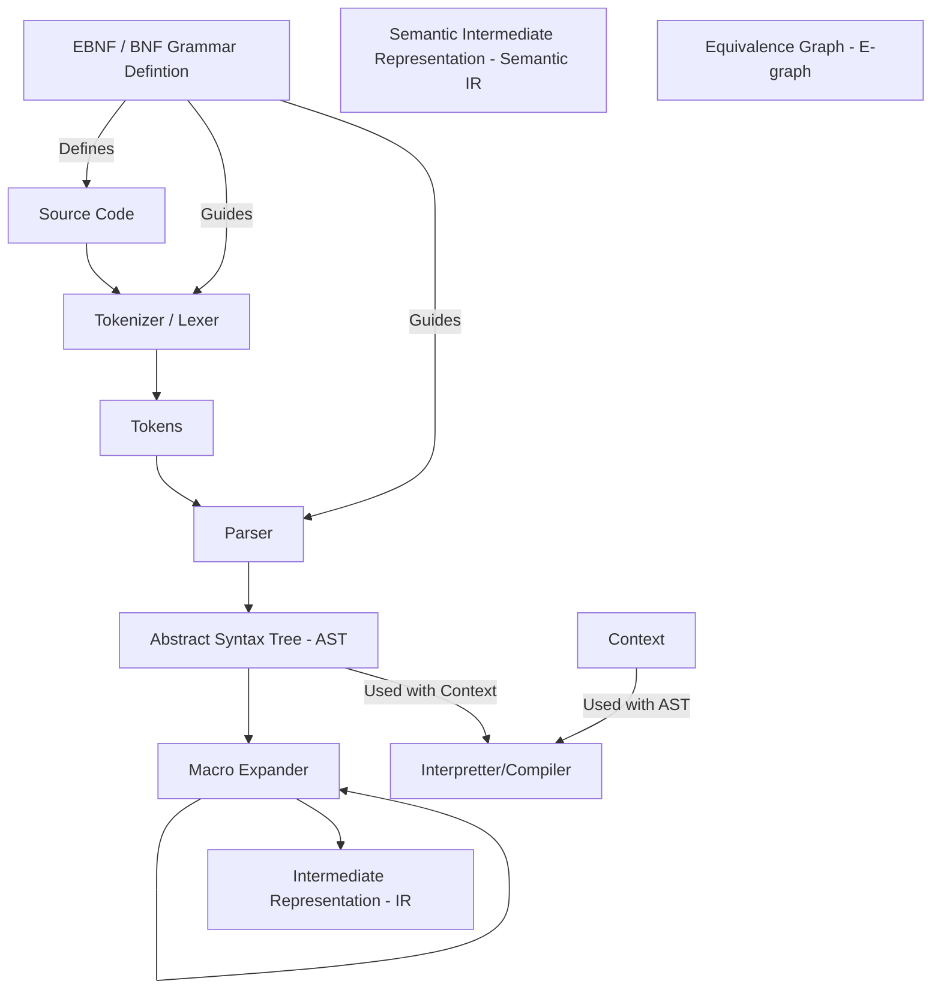

```mermaid

graph TD
    A[Source Code] --> B[Tokenizer / Lexer]
    B --> C[Tokens]
    C --> D[Parser]
    D --> E[Abstract Syntax Tree - AST]
    E --> F[Macro Expander]
    F --> F
    G[EBNF / BNF Grammar Defintion] --> | Defines| A
    G --> | Guides | B
    G --> | Guides | D
    H[Context] --> | Used with AST | I[Interpretter/Compiler]
    E --> | Used with Context | I
    F --> J[Intermediate Representation - IR]
    K[Semantic Intermediate Representation - Semantic IR]
    L[Equivalence Graph - E-graph]

```
