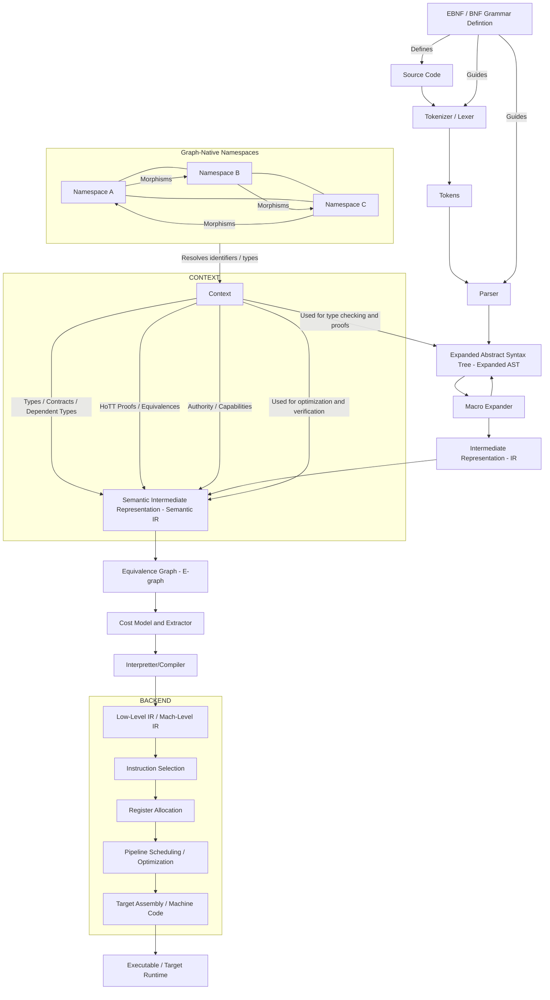

```mermaid

graph TD
    %% --- SOURCE AND FRONT-END ---
    A[Source Code] --> B[Tokenizer / Lexer]
    B --> C[Tokens]
    C --> D[Parser]
    D --> E[Expanded Abstract Syntax Tree - Expanded AST]
    E --> F[Macro Expander]
    F --> E

    %% --- GRAMMAR GUIDANCE ---
    G[EBNF / BNF Grammar Defintion] --> | Defines| A
    G --> | Guides | B
    G --> | Guides | D

    subgraph NAMESPACE_GRAPH["Graph-Native Namespaces"]
        N1[Namespace A]
        N2[Namespace B]
        N3[Namespace C]
        N1 --- N2
        N2 --- N3
        N1 --- N3
    end

    %% Context morphisms
    N1 --> |Morphisms| N2
    N2 --> |Morphisms| N3
    N3 --> |Morphisms| N1
    NAMESPACE_GRAPH --> |Resolves identifiers / types| H
    
    %% --- CONTEXT & NAMESPACES ---
    subgraph CONTEXT
        H[Context]
        H --> |Types / Contracts / Dependent Types| K
        H --> |HoTT Proofs / Equivalences| K
        H --> |Authority / Capabilities| K
    end
    
    H --> | Used for type checking and proofs | E
    F --> J[Intermediate Representation - IR]

    
    J --> K[Semantic Intermediate Representation - Semantic IR]
    H --> | Used for optimization and verification | K
    
    %% --- SEMANTIC OPTIMIZER ---
    K --> L[Equivalence Graph - E-graph]
    L --> M[Cost Model and Extractor]
    M --> I[Interpretter/Compiler]
    

    %% --- BACKEND / MACH LEVEL ---
    subgraph BACKEND
        N[Low-Level IR / Mach-Level IR]
        O[Instruction Selection]
        P[Register Allocation]
        Q[Pipeline Scheduling / Optimization]
        R[Target Assembly / Machine Code]
    end

    I --> N
    N --> O --> P --> Q --> R
    R --> S[Executable / Target Runtime]
    


```
