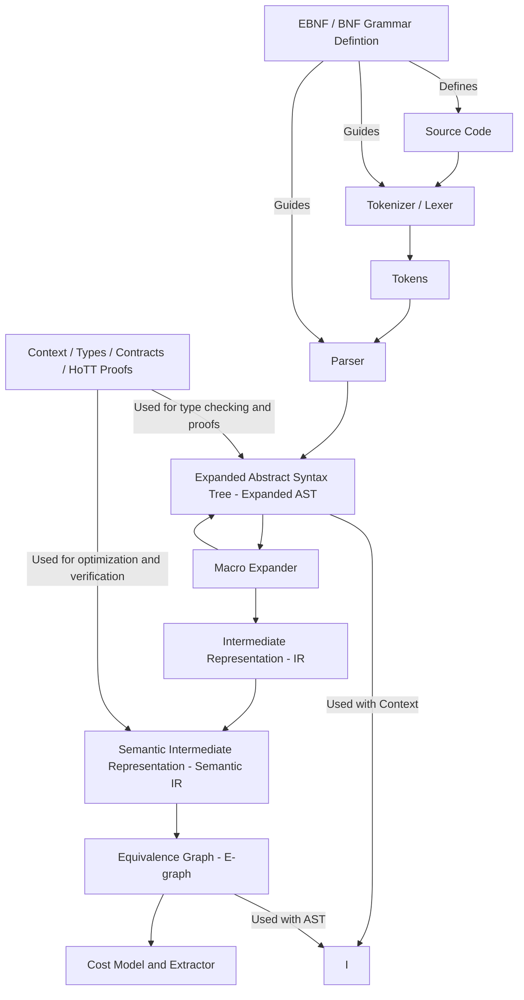

```mermaid

graph TD
    A[Source Code] --> B[Tokenizer / Lexer]
    B --> C[Tokens]
    C --> D[Parser]
    D --> E[Expanded Abstract Syntax Tree - Expanded AST]
    E --> F[Macro Expander]
    F --> E
    G[EBNF / BNF Grammar Defintion] --> | Defines| A
    G --> | Guides | B
    G --> | Guides | D
    H[Context / Types / Contracts / HoTT Proofs] 
    H --> | Used for type checking and proofs | E
    E --> | Used with Context | I
    F --> J[Intermediate Representation - IR]
    J --> K[Semantic Intermediate Representation - Semantic IR]
    H --> | Used for optimization and verification | K
    K --> L[Equivalence Graph - E-graph]
    L --> M[Cost Model and Extractor]
    L --> | Used with AST | I

```
