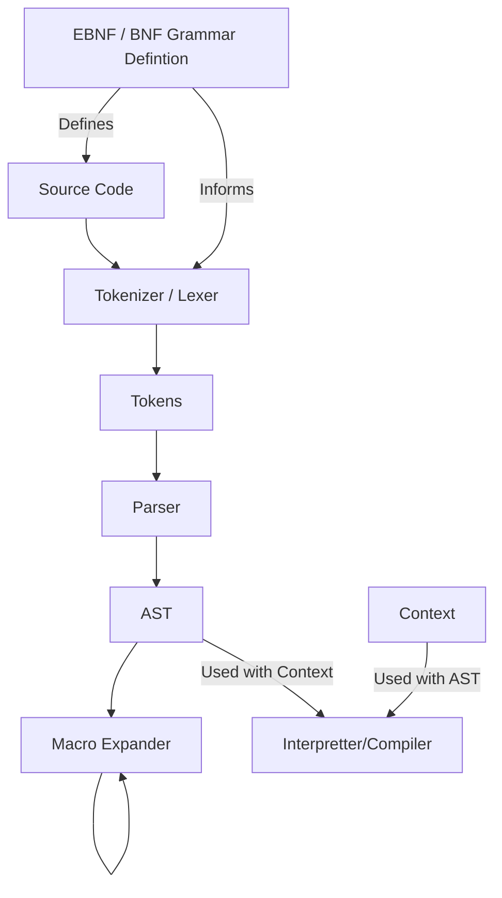

```mermaid

graph TD
    A[Source Code] --> B[Tokenizer / Lexer]
    B --> C[Tokens]
    C --> D[Parser]
    D --> E[AST]
    E --> F[Macro Expander]
    F --> F
    G[EBNF / BNF Grammar Defintion] --> | Defines| A
    G --> | Informs | B
    H[Context] --> | Used with AST | I[Interpretter/Compiler]
    E --> | Used with Context | I

```
