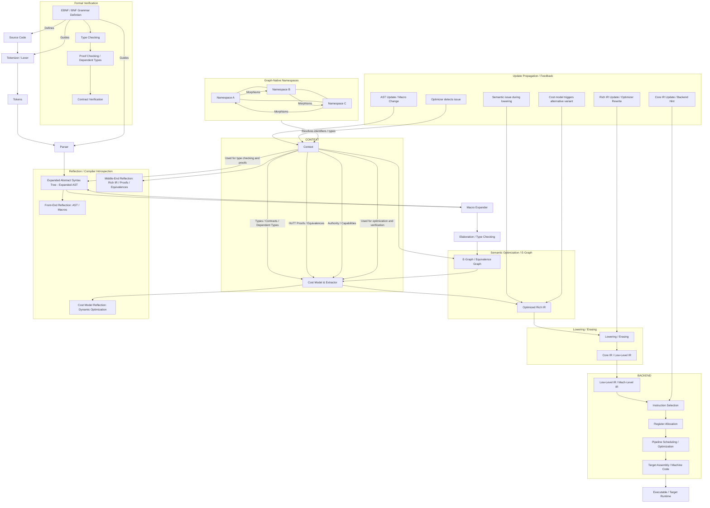

```mermaid

graph TD
    %% --- SOURCE AND FRONT-END ---
    A[Source Code] --> B[Tokenizer / Lexer]
    B --> C[Tokens]
    C --> D[Parser]
    D --> E[Expanded Abstract Syntax Tree - Expanded AST]
    E --> F[Macro Expander]
    F --> E

    %% --- GRAMMAR GUIDANCE ---
    G[EBNF / BNF Grammar Defintion] --> | Defines| A
    G --> | Guides | B
    G --> | Guides | D

    subgraph NAMESPACE_GRAPH["Graph-Native Namespaces"]
        N1[Namespace A]
        N2[Namespace B]
        N3[Namespace C]
        N1 --- N2
        N2 --- N3
        N1 --- N3
    end

    %% Context morphisms
    N1 --> |Morphisms| N2
    N2 --> |Morphisms| N3
    N3 --> |Morphisms| N1
    NAMESPACE_GRAPH --> |Resolves identifiers / types| H
    
    %% --- CONTEXT & NAMESPACES ---
    subgraph CONTEXT
        H[Context]
        H --> |Types / Contracts / Dependent Types| K
        H --> |HoTT Proofs / Equivalences| K
        H --> |Authority / Capabilities| K
    end
    
    H --> | Used for type checking and proofs | E
    F --> EE[Elaboration / Type Checking] --> J[High-Level - Semantic Intermediate Representation - Rich IR]

    
    H --> | Used for optimization and verification | K
    
    %% --- MIDDLE-END / SEMANTIC OPTIMIZER ---
    subgraph MiddleEnd["Semantic Optimization / E-Graph"]
        H --> J[E-Graph / Equivalence Graph]
        J --> K[Cost Model & Extractor]
        K --> L[Optimized Rich IR]
    end

    %% --- LOWERING ---
    subgraph LoweringStage["Lowering / Erasing"]
        L --> M[Lowering / Erasing]
        M --> N[Core IR / Low-Level IR]
    end
    

    %% --- BACKEND / MACH LEVEL ---
    subgraph BACKEND
        O[Low-Level IR / Mach-Level IR]
        P[Instruction Selection]
        Q[Register Allocation]
        R[Pipeline Scheduling / Optimization]
        S[Target Assembly / Machine Code]
    end

    N --> O
    O --> P --> Q --> R --> S
    S --> T[Executable / Target Runtime]

    %% --- REFLECTION POINTS ---
    subgraph Reflection["Reflection / Compiler Introspection"]
        R1[Front-End Reflection: AST / Macros]
        R2[Middle-End Reflection: Rich IR / Proofs / Equivalences]
        R3[Cost Model Reflection: Dynamic Optimization]
        
        E --> R1
        H --> R2
        K --> R3
    end

    %% --- FORMAL VERIFICATION ---
    subgraph Verification["Formal Verification"]
        V1[Type Checking]
        V2[Proof Checking / Dependent Types]
        V3[Contract Verification]

        G --> V1 --> V2 --> V3
    end

    %% --- MULTI-STAGE UPDATE FEEDBACK ---
    subgraph Updates["Update Propagation / Feedback"]
        %% Forward
        ASTUpdate[AST Update / Macro Change] --> H
        RichIRUpdate[Rich IR Update / Optimizer Rewrite] --> M
        CoreIRUpdate[Core IR Update / Backend Hint] --> P
        
        %% Backward
        OptimizerFeedback[Optimizer detects issue] --> H
        LoweringFeedback[Semantic issue during lowering] --> L
        CostModelFeedback[Cost model triggers alternative variant] --> L
    end
    


```
